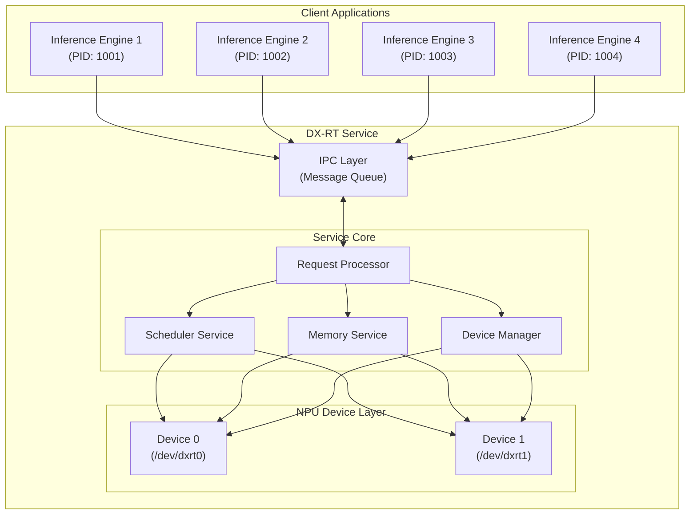

# DX-RT 서비스 심층 분석 (Deep Dive)

## 1. 개요

DX-RT(DEEPX Runtime) 서비스는 다중 프로세스/스레드 환경에서 NPU(Neural Processing Unit) 자원을 효율적이고 안정적으로 관리하기 위해 설계된 **중앙 집중식 리소스 관리 시스템**입니다. 

여러 개의 `InferenceEngine` 인스턴스가 동시에 실행될 때, 각 인스턴스에서 요청하는 NPU 하드웨어 자원(메모리, 연산 코어 등)의 할당과 스케줄링을 서비스가 전담하여 처리합니다. 이를 통해 리소스 충돌을 방지하고, 시스템 전체의 처리량을 극대화하며, 특정 프로세스가 비정상적으로 종료되더라도 시스템의 안정성을 유지하는 핵심적인 역할을 수행합니다.

---

## 2. 핵심 개념

DX-RT 서비스를 이해하기 위해 다음 두 가지 핵심 개념을 먼저 이해해야 합니다.

### 2.1. Inference Engine

- **개념**: `InferenceEngine`은 **사용자 애플리케이션(Client) 관점에서의 추론 실행 단위**입니다. 사용자는 `InferenceEngine` 객체를 생성하고, 모델 파일(.dxnn)을 로드하여 추론을 실행합니다.
- **역할**:
    - 모델 파일 파싱 및 유효성 검증
    - 모델을 NPU Task와 CPU Task로 분할
    - DX-RT 서비스에 NPU Task 등록 및 리소스 요청
    - 추론 실행 및 결과 반환
- **생명주기**: 하나의 `InferenceEngine` 인스턴스는 일반적으로 애플리케이션의 프로세스 내에서 생성되고 소멸됩니다. Multi-process 시나리오에서는 각 프로세스가 자신만의 `InferenceEngine` 인스턴스를 갖게 됩니다.

### 2.2. NPU Task

- **개념**: `Task`는 **DX-RT 서비스 관점에서의 작업 처리 단위**입니다. `InferenceEngine`이 로드한 모델 그래프는 하나 이상의 `Task`로 구성되며, 각 `Task`는 NPU 또는 CPU에서 실행될 수 있는 독립적인 연산의 묶음입니다. **DX-RT 서비스 NPU `Task`만 관리합니다.**
- **자원 할당 단위**: DX-RT 서비스는 바로 이 `Task` 단위를 기준으로 NPU 메모리와 같은 하드웨어 자원을 할당하고 관리합니다. 예를 들어, `Task A`와 `Task B`는 동일한 프로세스에 속해 있더라도 별개의 메모리 공간을 할당받을 수 있습니다.
- **서비스의 관리 대상**: 클라이언트의 `InferenceEngine`이 `TASK_INIT`을 요청하면, 서비스는 해당 Task를 위한 리소스를 할당하고 내부적으로 메타데이터(`_taskInfo`, `_devInfo`)를 통해 어떤 프로세스(PID)의 어떤 Task(Task ID)가 어떤 디바이스(Device ID)의 자원을 사용 중인지 추적합니다.

---

## 3. 시스템 아키텍처

DX-RT 서비스는 여러 컴포넌트가 유기적으로 상호작용하는 계층적 구조를 가집니다.



- **Client Applications**: `InferenceEngine`을 사용하여 추론을 요청하는 다수의 사용자 프로세스입니다.
- **IPC (Inter-Process Communication) Layer**: 클라이언트와 서비스 간의 통신 계층입니다. `Message Queue`를 사용하여 비동기적으로 요청과 응답을 주고받습니다.
- **Service Core**: 서비스의 핵심 로직을 담당합니다.
    - **Request Processor**: IPC로 들어온 클라이언트 요청(`REQUEST_CODE`)을 분석하고, 적절한 내부 서비스(메모리, 스케줄러 등)에 전달합니다.
    - **Memory Service**: NPU 디바이스 메모리의 할당, 해제, 최적화를 전담합니다.
    - **Scheduler Service**: 추론 요청(`REQUEST_SCHEDULE_INFERENCE`)을 받아 FIFO, Round Robin, SJF 등의 정책에 따라 NPU에서 실행될 순서를 결정합니다.
    - **Device Manager**: NPU 디바이스의 상태를 관리하고, Task의 NPU 바인딩 옵션을 설정합니다.
- **NPU Device Layer**: 실제 NPU 하드웨어를 제어하는 드라이버와의 인터페이스 계층입니다.

---

## 4. 핵심 동작 프로세스

### 4.1. Host ↔ Device 요청/응답 프로세스 (추론 요청 중심)

1.  **[Client] 추론 요청**: `InferenceEngine`이 `RunAsync()`를 호출하면, 추론에 필요한 정보가 `IPCClientMessage` 구조체에 담겨 서비스의 메시지 큐로 전송됩니다 (`REQUEST_SCHEDULE_INFERENCE`).
2.  **[Service] 요청 수신 및 검증**: 서비스의 `Process()` 함수가 메시지를 수신합니다. 요청한 `PID`와 `Task ID`가 유효한지, 등록된 `NPU Bound Option`을 사용하는지 등을 `IsTaskValid()`와 `_devInfo`를 통해 검증합니다.
3.  **[Service] 스케줄링**: 검증이 완료되면 `SchedulerService::AddScheduler()`를 호출하여 요청을 스케줄러에 추가합니다.
    -   이때 NPU 디바이스의 부하(`_loads`)를 확인하여 임계값(`DX_RT_SERVICE_SCHED_THRE`)보다 낮으면 즉시 `schedule()`을 호출하고, 높으면 큐에 대기시킵니다.
4.  **[Service] 추론 실행**: `schedule()` 함수는 정책에 따라 대기 중인 요청을 하나 꺼내 `ServiceDevice::InferenceRequest()`를 호출합니다. 이는 드라이버 `ioctl`을 통해 실제 NPU에 추론 명령을 전달합니다.
5.  **[Device] 추론 완료 및 응답**: NPU가 추론을 완료하면 `ServiceDevice`의 응답 대기 스레드(`WaitThread`)가 인터럽트를 통해 결과를 수신합니다.
6.  **[Service] 콜백 체인**: `WaitThread`는 `SchedulerService::FinishJobs` 콜백을, `FinishJobs`는 다시 `DxrtService::onCompleteInference` 콜백을 호출하며 처리가 위로 전파됩니다.
7.  **[Service] 클라이언트로 응답 전송**: `onCompleteInference` 함수는 최종 결과를 `IPCServerMessage`에 담아 요청했던 클라이언트의 `PID`에 해당하는 메시지 큐로 응답을 전송합니다.
8.  **[Client] 결과 수신**: 클라이언트의 `InferenceEngine`은 이 응답을 받아 사용자에게 최종 결과를 반환합니다.

### 4.2. Multi-Process 시나리오와 메모리 관리

DX-RT 서비스의 가장 중요한 역할 중 하나는 여러 `InferenceEngine` 인스턴스(프로세스)가 생성되고 소멸될 때 메모리를 안정적으로 관리하는 것입니다.

#### Task 초기화 시 디바이스 선택 로직

- **InferenceEngine은 기본적으로 모든 사용 가능한 디바이스에 Task를 등록하는 구조**입니다.
- 실제 코드에서는, 사용 가능한 device_id 리스트를 순회하며 각 Task를 모든 디바이스에 등록합니다.
- 예시 코드:
  ```cpp
  for (int device_id : device_ids) {
      for (auto& task : tasks) {
          task->InitializeTaskWithService(device_id);
      }
  }
  ```
- 만약 특정 디바이스만 선택적으로 등록하려면, 상위에서 device_ids 리스트를 제한해야 합니다.

#### 메모리 관리 방식의 세부사항

- **DX-RT는 단순히 "얼마나 많은 메모리를 쓰는지"만 추적하는 것이 아니라, "어떤 주소(메모리 블록)"를 사용 중인지까지 정확히 추적**합니다.
- 내부적으로는 `std::map<pid_t, std::map<int, std::set<uint64_t>>> _taskAllocInfo;` 구조로, 각 Task별로 실제 할당된 메모리 주소(블록)들을 모두 기록합니다.
- 할당 시:  
  ```cpp
  uint64_t addr = _mem->Allocate(size);
  _taskAllocInfo[pid][taskId].insert(addr);
  ```
- 해제 시:  
  ```cpp
  for (auto addr : taskPair.second) {
      _mem->Deallocate(addr);
  }
  ```
- **size 정보 및 단편화 관리**:  
  - `dxrt::Memory` 클래스가 addr, size, free/used, fragmentation 등 모든 정보를 내부적으로 관리합니다.
  - `free_size()`, `used_size()`, `GetFragmentationInfo()`, `CanAllocateContiguous(size)` 등으로 메모리 상태를 추적합니다.
  - 단편화가 심할 경우 `CompactMemory()`로 메모리 압축도 수행합니다.

#### 메모리 단편화 관리 및 CompactMemory 로직

DX-RT는 메모리 단편화를 지능적으로 관리하여 큰 메모리 블록 할당 실패를 방지합니다.

**단편화 감지 및 임계값**:
- **단편화 비율 계산**: `(전체 여유 메모리 - 가장 큰 여유 블록) / 전체 여유 메모리`
- **임계값 설정**:
  ```cpp
  constexpr double HIGH_FRAGMENTATION_THRESHOLD = 0.75;     // 75%
  constexpr double MEDIUM_FRAGMENTATION_THRESHOLD = 0.5;   // 50%
  constexpr double LOW_FRAGMENTATION_THRESHOLD = 0.3;      // 30%
  constexpr uint64_t LARGE_ALLOCATION_THRESHOLD = 100 * 1024 * 1024;  // 100MB - 대용량 할당
  ```

**자동 단편화 해제 메커니즘**:
- **대용량 할당 시 자동 감지**: 100MB 이상의 메모리 할당 요청 시 단편화 상태를 확인
- **단편화 임계값 체크**: 단편화 비율이 50% 이상일 때 자동으로 `TryDefragmentation()` 호출
- **인접 블록 병합**: `MergeAllAdjacentFreeBlocks()`를 통해 인접한 여유 블록들을 자동 병합

**CompactMemory 동작 과정**:
```cpp
void MemoryService::OptimizeMemory() {
    auto fragInfo = _mem->GetFragmentationInfo();
    
    // 단편화가 30% 이상일 때 압축 수행
    if (fragInfo.fragmentation_ratio > MemoryConfig::LOW_FRAGMENTATION_THRESHOLD) {
        _mem->CompactMemory();
    }
}
```

**CompactMemory 내부 로직**:
1. **안전한 병합 방식**: 현재는 할당된 블록을 이동시키는 복잡한 압축 대신, 인접한 여유 블록들을 병합하는 안전한 방식을 사용
2. **병합 알고리즘**: 
   ```cpp
   void MergeAllAdjacentFreeBlocks() {
       // 인접한 여유 블록들을 반복적으로 병합
       // addr + size == next_addr인 경우 병합 수행
   }
   ```
3. **주기적 최적화**: 서비스의 `die_check_thread`에서 10초마다 모든 디바이스의 메모리를 자동으로 최적화

**단편화 정보 제공**:
```cpp
struct MemoryFragmentationInfo {
    uint64_t total_free_size;      // 전체 여유 메모리
    uint64_t largest_free_block;   // 가장 큰 여유 블록
    uint64_t smallest_free_block;  // 가장 작은 여유 블록
    size_t free_block_count;       // 여유 블록 개수
    double fragmentation_ratio;    // 단편화 비율
};
```

이러한 지능적인 메모리 관리로 인해 DX-RT는 장시간 실행되어도 메모리 단편화로 인한 할당 실패를 최소화할 수 있습니다.

#### 프로세스/Task 생성 시

- `InferenceEngine`이 생성되고 Task를 등록하면 `TASK_INIT` 요청이 서비스로 전달됩니다.
- `MemoryService`는 해당 Task가 사용할 모델 가중치 등의 메모리를 NPU 디바이스에 할당합니다 (`BackwardAllocateForTask`).
- 이때 `_taskAllocInfo[pid][taskId]` 맵에 할당된 메모리 주소들이 기록되어, 어떤 프로세스의 어떤 Task가 얼마만큼의 메모리를 사용하는지 정확히 추적합니다.

#### 프로세스 소멸 시 (정상/비정상)

- **핵심 기능**: `die_check_thread`
    - 서비스는 1초마다 백그라운드 스레드(`die_check_thread`)를 실행하여 관리 중인 모든 `PID`에 대해 `kill(pid, 0)` 시스템 콜을 날려 프로세스의 생존 여부를 확인합니다.
- **비정상 종료 감지**: 만약 `kill`이 `ESRCH` 에러를 반환하면 해당 `PID`의 프로세스가 비정상적으로 종료되었음을 감지하고 `handle_process_die(pid)` 함수를 호출합니다.
- **리소스 정리 프로세스 (`handle_process_die`)**:
    1.  **스케줄러 중지**: 해당 `PID`로부터 오는 새로운 추론 요청을 막기 위해 `_scheduler->StopScheduler(pid)`를 호출합니다.
    2.  **메타데이터 정리**: `_taskInfo`, `_devInfo` 등 서비스가 관리하던 모든 `PID` 관련 메타데이터를 제거합니다. NPU 바인딩 참조 카운트를 감소시키고, 더 이상 아무도 사용하지 않는 바인딩은 해제(`DX_SCHED_DELETE`)합니다.
    3.  **메모리 완전 해제**: `MemoryService::DeallocateAllDevice(pid)`를 호출합니다. `MemoryService`는 `_taskAllocInfo`와 `_legacyAllocInfo`를 참조하여 해당 `PID`에 할당되었던 **모든 메모리 블록을 해제**합니다.
    4.  **디바이스 상태 정리**: `ClearDevice` 함수를 비동기(`std::async`)로 호출하여 `PID`와 관련된 남은 디바이스 상태를 정리합니다.
- **정상 종료**: 클라이언트가 정상적으로 `InferenceEngine`을 소멸시키면 `PROCESS_DEINIT` 요청을 보내며, 이 역시 유사한 리소스 정리 절차를 수행합니다.

이러한 자동 감지 및 정리 메커니즘 덕분에, 특정 클라이언트 프로세스에 오류가 발생하여 비정상적으로 종료되더라도 해당 프로세스가 점유하던 모든 NPU 리소스는 완벽하게 회수되어 다른 프로세스가 사용할 수 있게 됩니다. 이는 시스템 전체의 안정성을 보장하는 핵심 기능입니다.

### 4.3. Multi-Device 관리

- **모든 디바이스가 항상 동일한 메모리 맵을 가지는 것은 아닙니다.**
- 각 디바이스별로 완전히 독립적인 메모리 공간을 관리합니다.
  - `MemoryService::getInstance(deviceId)`로 각 디바이스별로 별도의 메모리 관리 인스턴스가 존재합니다.
- 동일한 Task라도 deviceId가 다르면 서로 다른 물리적 메모리 공간에 할당됩니다.
- 메모리 할당/해제는 각 디바이스별로 독립적으로 일어납니다.

---

## 5. 결론

DX-RT 서비스는 여러 `InferenceEngine` 인스턴스가 동시에 실행되는 복잡한 환경에서 안정적이고 효율적인 NPU 리소스 관리를 제공하는 핵심 시스템입니다. 특히 다음과 같은 특징을 통해 그 역할을 수행합니다.

- **중앙 집중 관리**: 모든 NPU 자원을 단일 서비스에서 통합 관리하여 리소스 충돌을 원천적으로 방지합니다.
- **Task 기반 자원 추적**: 프로세스가 아닌 논리적 작업 단위인 `Task`를 기준으로 메모리를 할당하고 추적하여 정교한 리소스 관리를 수행합니다.
- **자동 장애 복구**: 프로세스의 비정상 종료를 자동으로 감지하고 관련 리소스를 완벽하게 회수하여 시스템 안정성을 극대화합니다.
- **독립적인 멀티 디바이스 지원**: 각 디바이스의 자원을 명확히 분리하고 관리하여 다중 NPU 환경을 효율적으로 지원합니다.

이러한 고급 기능들은 멀티 프로세스, 멀티 디바이스 환경에서의 안정성을 보장하며, 다양한 스케줄링 알고리즘과 메모리 최적화 기법을 통해 높은 성능을 달성합니다. 