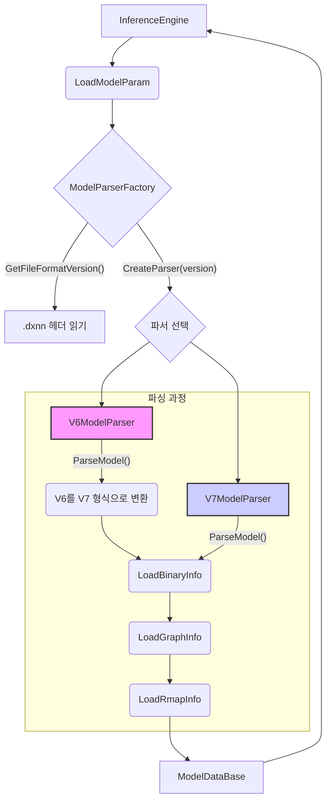

# 모델 파싱 아키텍처 개요

이 문서는 DXRT 런타임의 모델 파싱 아키텍처에 대한 개발자용 개요를 제공합니다. `.dxnn` 모델을 로드하고 실행을 위해 준비하는 데 관련된 핵심 개념, 구성 요소 및 데이터 흐름을 설명하는 것을 목적으로 합니다.

## 1. 상위 레벨 개념

핵심 아이디어는 다양한 버전의 `.dxnn` 모델 형식을 처리할 수 있는 유연한 파싱 시스템을 만드는 것입니다. 이는 **팩토리 패턴(Factory Pattern)** 을 사용하여 달성됩니다. `InferenceEngine`이 생성될 때 모델 형식의 세부 사항을 알지 못합니다. 대신 파싱 작업을 `ModelParserFactory`에 위임하며, 이 팩토리는 모델 파일을 검사하고 버전을 확인한 다음 해당 버전에 맞는 전문 파서를 반환합니다.

이 설계를 통해 향후 핵심 `InferenceEngine` 로직을 수정하지 않고도 새 파서 클래스를 생성하기만 하면 새로운 모델 형식을 쉽게 추가할 수 있습니다.

파싱 프로세스는 주로 세 단계로 이루어집니다:
1.  **바이너리 정보 파싱(Binary Info Parsing)**: `.dxnn` 파일 헤더를 읽어 바이너리 내의 섹션과 그 위치(오프셋 및 크기)를 식별합니다. 여기에는 그래프 구조, 레지스터 맵(rmap), 가중치 및 CPU 전용 모델에 대한 섹션이 포함됩니다.
2.  **그래프 정보 파싱(Graph Info Parsing)**: JSON 표현에서 그래프 구조를 파싱합니다. 이를 통해 계산 그래프를 구축하고, 다양한 서브그래프(`npu_0`, `cpu_1` 등), 이를 연결하는 텐서 및 전체 실행 순서를 정의합니다.
3.  **Rmap 정보 파싱(Rmap Info Parsing)**: 상세한 레지스터 맵(rmap) 정보를 파싱합니다. 이는 텐서 모양, 데이터 유형, 메모리 레이아웃 및 양자화 매개변수를 포함하여 각 하드웨어 가속 작업에 대한 저수준 세부 정보를 제공합니다.

오래된 모델 형식(예: V6)의 경우, 최종 파싱 단계 전에 레거시 구조를 현재 V7 표준으로 변환하는 추가 변환 단계가 내부적으로 수행됩니다.

## 2. 핵심 구성 요소 및 데이터 흐름

다음 다이어그램은 모델 초기화 중 데이터 흐름을 보여줍니다:

### 주요 클래스 및 함수:

-   **`InferenceEngine`**: 추론 실행을 위한 기본 진입점입니다. 생성자가 모델 로딩 프로세스를 트리거합니다.
-   **`LoadModelParam` (`model.cpp`)**: `ModelParserFactory`를 호출하여 파싱을 총괄하는 전역 헬퍼 함수입니다.
-   **`ModelParserFactory` (`model_parser_factory.cpp`)**:
    -   `GetFileFormatVersion()`: `.dxnn` 파일의 첫 8바이트를 읽어 형식 버전(예: 6 또는 7)을 결정합니다.
    -   `CreateParser()`: 버전에 따라 `V6ModelParser` 또는 `V7ModelParser`를 인스턴스화하여 반환합니다.
-   **`IModelParser` (인터페이스)**: 모든 파서 클래스에 대한 공통 인터페이스, 주로 `ParseModel` 메서드를 정의합니다.
-   **`V7ModelParser` (`parsers/v7_model_parser.cpp`)**:
    -   현재 표준인 V7 `.dxnn` 형식을 처리합니다.
    -   `ParseModel()`: 내부 `LoadBinaryInfo`, `LoadGraphInfo`, `LoadRmapInfo` 메서드를 순차적으로 호출하여 `ModelDataBase`를 채웁니다.
    -   로딩 메서드는 파일의 각 JSON 및 바이너리 섹션을 파싱합니다.
-   **`V6ModelParser` (`parsers/v6_model_parser.cpp`)**:
    -   레거시 V6 `.dxnn` 형식을 처리합니다.
    -   `ParseModel()`:
        1.  먼저 자체 `LoadBinaryInfo`를 호출하여 V6 파일 구조를 파싱하고 원시 V6 `graph_info` 및 `rmap_info` JSON 문자열을 로드합니다.
        2.  그런 다음 `ConvertGraphInfoV6ToV7` 및 `ConvertRmapInfoV6ToV7`을 호출하여 V6 JSON 구조를 메모리에서 V7 형식으로 변환합니다.
        3.  마지막으로, 표준 `LoadGraphInfo` 및 `LoadRmapInfo`(V7 파서에서 사용하는 것과 동일)를 호출하여 새로 변환된 V7 호환 데이터를 파싱합니다.
    -   이 접근 방식은 코드 재사용을 극대화하고 레거시 변환 로직을 `V6ModelParser` 내에 격리합니다.

## 3. 주요 데이터 구조

-   **`ModelDataBase` (`model.h`)**: 모델 파일에서 파싱된 모든 정보를 담는 중앙 데이터 구조입니다. `InferenceEngine`에 전달되어 태스크를 구성하는 데 사용됩니다. 세 가지 주요 하위 구조를 포함합니다:
    -   **`deepx_binaryinfo::BinaryInfoDatabase`**: 가중치, rmap 및 CPU 모델에 대한 원시 바이너리 데이터와 오프셋 및 크기와 같은 메타데이터를 저장합니다.
    -   **`deepx_graphinfo::GraphInfoDatabase`**: 서브그래프 목록, 토폴로지 순서, 모델의 기본 입력 및 출력을 포함하여 상위 수준 계산 그래프를 나타냅니다.
    -   **`deepx_rmapinfo::rmapInfoDatabase`**: 모델의 `rmap_info.json` 섹션에서 파생된 각 NPU 태스크에 대한 저수준 하드웨어별 세부 정보를 포함합니다.

## 4. 새 모델 버전을 위한 온보딩 가이드

가상의 "V8" 모델 형식에 대한 지원을 추가하려면 개발자는 다음 단계를 따릅니다:

1.  **`V8ModelParser.h` 및 `V8ModelParser.cpp` 생성**: `lib/include/dxrt/parsers/` 및 `lib/parsers/` 디렉토리에 새 파일을 생성합니다.
2.  **`V8ModelParser` 구현**:
    -   클래스는 `IModelParser`를 상속해야 합니다.
    -   `ParseModel` 메서드와 V8 형식의 세부 사항을 처리하는 데 필요한 모든 비공개 헬퍼(예: `LoadBinaryInfoV8`)를 구현합니다.
    -   V8 형식이 V7에서 약간 변경된 경우, `V6ModelParser`가 작동하는 방식과 유사하게 변환 단계 후 `LoadGraphInfo` 및 `LoadRmapInfo` 메서드를 재사용할 수 있습니다.
3.  **`ModelParserFactory` 업데이트**:
    -   `CreateParser` 메서드에 `case 8: return std::make_unique<V8ModelParser>();`를 추가합니다.
    -   지원되는 버전 목록에 `8`을 추가합니다.
4.  **버전 정의 업데이트**: `model.h`에서 `MAX_SINGLEFILE_VERSION`을 업데이트합니다.

이 모듈식 설계를 통해 기존 코드베이스에 최소한의 영향을 미치면서 새 버전을 통합할 수 있습니다. 