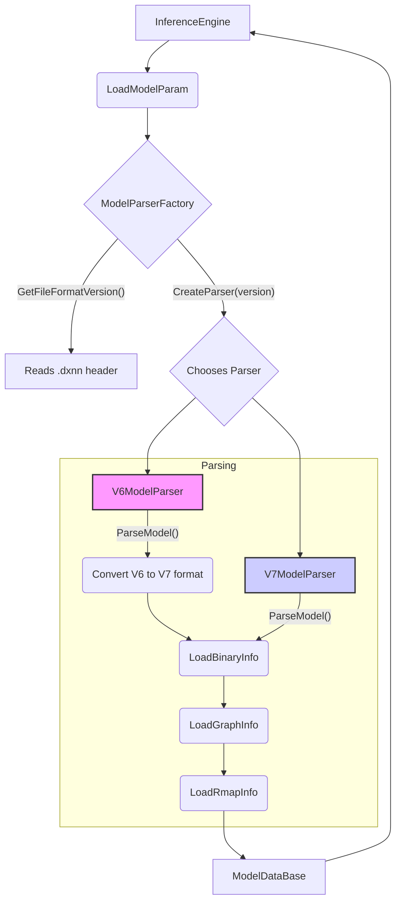

# Model Parsing Architecture Overview

This document provides a developer-focused overview of the model parsing architecture in the DXRT runtime. Its purpose is to explain the key concepts, components, and data flow involved in loading and preparing a `.dxnn` model for execution.

## 1. High-Level Concept

The core idea is to create a flexible parsing system that can handle different versions of the `.dxnn` model format. This is achieved using a **Factory Pattern**. When the `InferenceEngine` is created, it doesn't know the specifics of the model format. Instead, it delegates the parsing task to a `ModelParserFactory`, which inspects the model file, determines its version, and returns a specialized parser for that version.

This design allows us to easily add support for new model formats in the future by simply creating a new parser class, without modifying the core `InferenceEngine` logic.

The parsing process involves three main stages:
1.  **Binary Info Parsing**: Reading the `.dxnn` file header to identify sections and their locations (offsets and sizes) within the binary. This includes sections for graph structure, register maps (rmaps), weights, and CPU-specific models.
2.  **Graph Info Parsing**: Parsing the graph structure from its JSON representation. This builds the computation graph, defining the different subgraphs (e.g., `npu_0`, `cpu_1`), the tensors that connect them, and the overall execution order.
3.  **Rmap Info Parsing**: Parsing the detailed register map (rmap) information. This provides low-level details for each hardware-accelerated task, including tensor shapes, data types, memory layouts, and quantization parameters.

For older model formats (like V6), an additional conversion step is performed internally to bring the legacy structures up to the current V7 standard before the final parsing stages.

## 2. Core Components & Data Flow

The following diagram illustrates the data flow during model initialization:

### Key Classes and Functions:

-   **`InferenceEngine`**: The main entry point for running inference. Its constructor triggers the model loading process.
-   **`LoadModelParam` (`model.cpp`)**: A global helper function that orchestrates the parsing by invoking the `ModelParserFactory`.
-   **`ModelParserFactory` (`model_parser_factory.cpp`)**:
    -   `GetFileFormatVersion()`: Reads the first 8 bytes of the `.dxnn` file to determine the format version (e.g., 6 or 7).
    -   `CreateParser()`: Based on the version, it instantiates and returns either a `V6ModelParser` or a `V7ModelParser`.
-   **`IModelParser` (Interface)**: Defines the common interface for all parser classes, primarily the `ParseModel` method.
-   **`V7ModelParser` (`parsers/v7_model_parser.cpp`)**:
    -   Handles the current, standard V7 `.dxnn` format.
    -   `ParseModel()`: Calls the internal `LoadBinaryInfo`, `LoadGraphInfo`, and `LoadRmapInfo` methods in sequence to populate the `ModelDataBase`.
    -   The loading methods parse the respective JSON and binary sections of the file.
-   **`V6ModelParser` (`parsers/v6_model_parser.cpp`)**:
    -   Handles the legacy V6 `.dxnn` format.
    -   `ParseModel()`:
        1.  First, it calls its own `LoadBinaryInfo` to parse the V6 file structure and load the raw V6 `graph_info` and `rmap_info` JSON strings.
        2.  It then calls `ConvertGraphInfoV6ToV7` and `ConvertRmapInfoV6ToV7` to translate the V6 JSON structures into the V7 format in memory.
        3.  Finally, it calls the standard `LoadGraphInfo` and `LoadRmapInfo` (the same ones used by the V7 parser) to parse the newly converted V7-compatible data.
    -   This approach maximizes code reuse and isolates the legacy conversion logic within the `V6ModelParser`.

## 3. Key Data Structures

-   **`ModelDataBase` (`model.h`)**: The central data structure that holds all the information parsed from the model file. It is passed to the `InferenceEngine` to construct the tasks. It contains three main sub-structures:
    -   **`deepx_binaryinfo::BinaryInfoDatabase`**: Stores the raw binary data for weights, rmaps, and CPU models, along with metadata like offsets and sizes.
    -   **`deepx_graphinfo::GraphInfoDatabase`**: Represents the high-level computation graph, including the list of subgraphs, their topological order, and the model's primary inputs and outputs.
    -   **`deepx_rmapinfo::rmapInfoDatabase`**: Contains the low-level, hardware-specific details for each NPU task, derived from the `rmap_info.json` section of the model.

## 4. Onboarding Guide for New Model Versions

To add support for a hypothetical "V8" model format, a developer would follow these steps:

1.  **Create `V8ModelParser.h` and `V8ModelParser.cpp`**: Create new files in the `lib/include/dxrt/parsers/` and `lib/parsers/` directories.
2.  **Implement `V8ModelParser`**:
    -   The class should inherit from `IModelParser`.
    -   Implement the `ParseModel` method and any private helpers needed to handle the specifics of the V8 format (e.g., `LoadBinaryInfoV8`).
    -   If the V8 format is a minor change from V7, it might be possible to reuse the `LoadGraphInfo` and `LoadRmapInfo` methods after a conversion step, similar to how `V6ModelParser` works.
3.  **Update `ModelParserFactory`**:
    -   Add `case 8: return std::make_unique<V8ModelParser>();` to the `CreateParser` method.
    -   Add `8` to the list of supported versions.
4.  **Update Version Defines**: Update `MAX_SINGLEFILE_VERSION` in `model.h`.

This modular design ensures that new versions can be integrated with minimal impact on the existing codebase. 