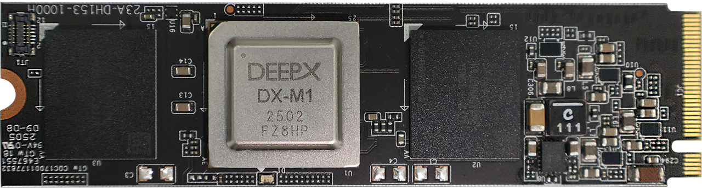

This chapter describes the system requirements, source file structure, and the installation instructions for setting up **DX-RT** on a Linux-based host system.  

After you check the system requirements, follow these instructions.  

- System Requirement Check  
- Build Environment Setup  
- Source File Structure Check  
- Linux Device Driver Installation  
- Python Package Installation  
- Service Registration  
- Sanity Check    

---

## System Requirements

This section describes the hardware and software requirements for running **DX-RT** on Linux.

**Hardware and Software Requirements**  

- **CPU:** amd64(x86_64), aarch64(arm64)
- **RAM:** 8GB RAM (16GB RAM or higher is recommended)
- **Storage:** 4GB or higher available disk space
- **OS:** Ubuntu 18.04 / 20.04 / 22.04 / 24.04 (x64)
- **Hardware:** The system **must** support connection to an **M1 M.2** module with the **M.2 interface** on the host PC. 

<div class="center-text">
<p align="center">
  
<br>
Figure. DX-M1 M.2 Module  
<br><br>
</p>
</div>

---

## Build Environment Setup

DEEPX provides an installation shell script to set up the **DX-RT** build environment. You can install the entire toolchain installation or perform a partial installation as necessary.

**DX-RT** supports the Target OS of **Ubuntu 18.04,** **Ubuntu 20.04,** **Ubuntu 22.04,** and **Ubuntu 24.04**. 

**Installation of DX-RT**  
To install the full **DX-RT** toolchain, use the following commands.  

```
$ cd dx_rt
$ ./install.sh --all
```

Here are the available `install.sh` options.  
```
Usage: ./install.sh [OPTIONS]
Install necessary components and libraries for the project.

Options:
  --help                       Display this help message and exit.
  --arch <ARCH>                Specify the target CPU architecture. Valid options: [x86_64, aarch64].
  --dep                        Install core dependencies such as cmake, gcc, ninja, etc and python3.
  --onnxruntime                (Optional) Install the ONNX Runtime library.
  --all                        Install all dependencies and the ONNX Runtime library.

  --python_version <VERSION>   Specify the Python version to install (e.g., 3.10.4).
                                 * Minimum supported version: .
                                 * If not specified:
                                     - For Ubuntu 20.04+, the OS default Python 3 will be used.
                                     - For Ubuntu 18.04, Python  will be source-built.
  --venv_path <PATH>          Specify the path for the virtual environment.
                                 * If this option is omitted, no virtual environment will be created.
```


**Installation with ONNX Runtime**  
Use the ONNX Runtime option if you need to offload certain neural network (NN) operations to the CPU that are **not** supported by the NPU.  

We recommend using ONNX Runtime linux x64 version more than v1.20.1.  
```
https://github.com/microsoft/onnxruntime/releases/download/v1.20.1/onnxruntime-linux-x64-1.20.1.tgz
$ sudo tar -xvzf onnxruntime-linux-x64-1.20.1.tgz -C /usr/local --strip-components=1
$ sudo ldconfig
```

To install the ONNX Runtime library, run the following command.  
```
./install.sh --onnxruntime
```

**Installation for a Specific CPU Architecture**  
The **DX-RT** targets the **x86_64** architecture. If you’re compiling for another architecture (e.g., **aarch64**), specify it using the `--arch` option. 
```
./install.sh --arch aarch64 --onnxruntime
```

---

## Source File Structure

The **DX-RT** source directory is organized as follows. 
You can install the full toolchain using the `install.sh`, and the build and library using `build.sh`.  

```
.
├── assets
├── bin
├── cli
├── build.sh
├── build_x86_64
├── build_aarch64
├── cmake
├── docs
├── examples
├── extern
├── install.sh
├── lib
├── python_package
├── service
└── tool
```

- `assets` Reference images.
- `bin` Compiled binary executables.
- `cli` Command-line application source code.
- `build.sh` Shell script for building the framework.
- `build_x86_64` / `build_aarch64` These directories are where the build artifacts are stored, specifically for the **x86_64** and **aarch64** architectures, respectively.
- `cmake` CMake scripts for build configuration.
- `docs` Markdown documents.
- `examples` Provides a set of practical inference examples that demonstrate how to use the DX-RT framework.
- `extern` Third-party libraries.
- `install.sh` Shell script for toolchain installation.
- `lib` The core source code for the DX-RT libraries.
- `python_package` Python modules for DX-RT.
- `service` Service unit files for runtime management.
- `tool` Profiler result visualization tools.

---

## Framework Build on Linux

After the **DX-RT** environment setup, you can build the framework using the provided build.sh shell script.

### Build Overview  

**DX-RT** supports the following target CPU architectures:   
  - **x86_64** for desktop/server-class hosts  
  - **aarch64** for embedded systems and ARM-based platforms  

You can select the target architecture using the `--arch` option in the build script.

---

### Recommended Build Process (Clean option)  

This chapter explains the importance of performing a clean build to maintain a stable and conflict-free build environment.   
To do this, you **must** run a `clean` operation before starting any new build process. 

```bash
# First, clean the previous build artifacts
$ ./build.sh --clean

# Then, run the build with your desired options
$ ./build.sh
```

You can also combine these commands. The `&&` operator ensures that the build command will only run if the clean command succeeds.  

```bash
$ ./build.sh --clean && ./build.sh
```

---

### Build Script Options

This chapter explains the available options for the `build.sh` script, which is used to compile the **DX-RT** framework.  

```
Usage: ./build.sh [OPTIONS]
Build the dx-rt project with various options.

Options:
  --help            Display this help message and exit.
  --clean           Perform a clean build, removing previous build artifacts.
  --verbose         Show detailed build commands during the process.
  --type <TYPE>     Specify the CMake build type. Valid options: [Release, Debug, RelWithDebInfo].
  --arch <ARCH>     Specify the target CPU architecture. Valid options: [x86_64, aarch64].
  --install <PATH>  Specify the installation path for dx-rt files.
  --uninstall       Remove previously installed dx-rt files.
  --docker          Build the project within a Docker environment.
  --clang           Use Clang as the compiler for the build.
  --coverage        Enable code coverage collection (automatically enabled for Debug builds).

  --python_exec <PATH> Specify the Python executable to use for the build.
                    If omitted, the default system 'python3' will be used.
  --venv_path <PATH>  Specify the path to a virtual environment to activate for the build.
                    If omitted, no virtual environment will be activated.
```

---

### Examples for Build Script Option

**Example 1: Clean Build and Install (Recommended Workflow)**  

This example shows the safest way to build and install the library.  
First, you clean the workspace, then you build for a specific architecture and install the libraries to a system path.  

```bash
# Step 1: Clean the workspace to ensure no old files interfere
$ ./build.sh --clean

# Step 2: Build for the aarch64 architecture and install to /usr/local
$ ./build.sh --arch aarch64 --install /usr/local
```

**Example 2: Build a Debug Version**  

To build the framework with debugging symbols, which is useful for development and troubleshooting.  

```bash
# Clean is recommended here as well, especially if your last build was a Release version
$ ./build.sh --clean

# Build with the 'Debug' type
$ ./build.sh --type Debug
```

**Example 3: Uninstall the Library**  

To remove all library files installed by a previous `--install` command.  

```bash
$ ./build.sh --uninstall
```

---

### Build Target Options  

This chapter explains how to configure optional build targets in **DX-RT**, such as enabling Python API support or shared library builds.  

These options can be set by editing the following configuration file: 
```
cmake/dxrt.cfg.cmake
```  

Here are the available options for building targets.  
```
option(USE_ORT "Use ONNX Runtime" ON)
option(USE_PYTHON "Use Python" ON)
option(USE_SERVICE "Use DXRT Service" ON)
```

- `USE_ORT`: Enables ONNX Runtime for NN (neural network) operations that NPU does **not** support
- `USE_PYTHON`: Enables Python API support
- `USE_SERVICE`: Enables service for multi-process support  

> **NOTE.**   
> After modifying `dxrt.cfg.cmake`, re-run the build with **./build.sh --clean** to apply changes.

---

### Build Guide for Cross-compile  

This section explains how to build the **DX-RT** framework for different CPU architectures, including native and cross-compile environments.  
Cross-compilation is typically used to build **DX-RT** on an **x86_64** host system for deployment on an ARM-based (**aarch64**) target.  

**Setup Files for Cross-compile**  
**DX-RT** supports the following CPU architectures:  
- **x86_64** — Native build on host system  
- **aarch64** — Cross-compile for ARM-based targets  

The default architecture is **x86_64**.  

**Toolchain Configuration**  
To cross-compile, configure a CMake toolchain file located at: 
```
cmake/toolchain.<CMAKE_SYSTEM_PROCESSOR>.cmake
```

Example: Toolchain for **aarch64**  
```
SET(CMAKE_C_COMPILER /usr/bin/aarch64-linux-gnu-gcc )
SET(CMAKE_CXX_COMPILER /usr/bin/aarch64-linux-gnu-g++ )
SET(CMAKE_LINKER /usr/bin/aarch64-linux-gnu-ld )
SET(CMAKE_NM /usr/bin/aarch64-linux-gnu-nm )
SET(CMAKE_OBJCOPY /usr/bin/aarch64-linux-gnu-objcopy )
SET(CMAKE_OBJDUMP /usr/bin/aarch64-linux-gnu-objdump )
SET(CMAKE_RANLIB /usr/bin/aarch64-linux-gnu-ranlib )
```

Customize the paths based on your toolchain installation.   


**Non Cross-compile Case (Build on Host)**  
To build and install **DX-RT** on the host system, run the following command.  

```
./build.sh --install /usr/local
```

Recommended install path: `/usr/local` (commonly included in system library search paths)  

**Cross-compile Case (Build for Target Architecture)**  
Cross-compile for a specific architecture, run the following command.  

```
./build.sh --arch <target_cpu>
```

Here are the examples of cross-compile cases.  
```
./build.sh --arch aarch64
./build.sh --arch x86_64
```

**Output Directory**  
After a successful build, output binaries are int the following directory.  

```
<build directory> /bin/
```

Typical contents:
```
<build directory>/bin/
 ├── dxrtd
 ├── dxrt-cli
 ├── parse_model
 ├── run_model
 └── examples
```

> **Note.**  
> Python for cross-compile is **not** supported in the current version, but will be supported in the next release.  

---

## Linux Device Driver Installation  

After building the **DX-RT** framework, you can install the Linux device driver for **M1 AI Accelerator (NPU).**  

> **NOTE.**  
> To install the Linux device driver, you can choose either **Section. DKMS and Debian Package** or **Section. Drier Source**.

### DKMS and Debian Package  

Before you begin, ensure you have `sudo` privileges and an active internet connection.  

#### Installing DKMS Debian Package

Here's how to install a DKMS (Dynamic Kernel Module Support) Debian package, along with explanations of messages you might see during the process.  

**Pre-installation Step (Recommended)**  
Before installing any Debian package, it's highly recommended to update your package lists. This ensures that your system has the most current information about available packages and their dependencies from the configured repositories. This step is particularly important when using `apt` for dependency resolution.

Update Package Lists:
```bash
sudo apt update
```

This command refreshes your system's package cache.

**Installation Steps**  
There are two primary ways to install a local DKMS Debian package:

***Using `sudo dpkg -i` (For direct package installation)***  

```bash
sudo dpkg -i [package_name.deb]
```

This command directly installs the `.deb` file. While it's quicker for simple installations, it does not automatically resolve dependencies. If your package has unmet dependencies, `dpkg` will warn you, and you might need to run `sudo apt --fix-broken install` afterward to resolve them.  

Just replace `[package_name.deb]` with the actual name of your Debian package file.  

***Using `sudo apt install` (Recommended for dependency handling)***  

```bash
sudo apt install ./[package_name.deb]
```

This method is generally preferred because `apt` automatically handles any package dependencies for you.

**Understanding Installation Messages**  
You might see various messages during installation, especially when using `sudo apt install`. Here's what they mean:  

***`initramfs` Messages***  

```
I: The initramfs will attempt to resume from /dev/dm-1
I: (/dev/mapper/vgubuntu-swap_1)
I: Set the RESUME variable to override this.
```

These are simply informational messages about your system's boot process, specifically regarding how `initramfs` handles resuming from a swap partition. They are not errors related to your DKMS package installation and you can safely ignore them. They indicate that your system is configured to resume from a swap partition during boot, which is a normal setup.

***"Permission denied" Message (when using `apt`)***  

```
N: Download is performed unsandboxed as root as file '/home/hslee/release/dkms_pacakge/dxrt-driver-dkms_1.5.0-1_all.deb' couldn't be accessed by user '_apt'. - pkgAcquire::Run (13: Permission denied)
```

This message can be a bit confusing, but it generally means your package installed successfully. It appears because:  

  * You're installing a local `.deb` file directly using `sudo apt install ./...`.  
  * Normally, `apt` downloads packages from remote repositories using a lower-privileged user (like `_apt`) for security.  
  * However, since you're using `sudo` to install a local file, you're already operating with root privileges. The message simply tells you that the `_apt` user, which has lower permissions, couldn't access the local file.  

In short, the installation went through fine because you used `sudo`. This message is just `apt` letting you know about a security check it couldn't perform on a local file, but it doesn't affect the successful installation.  

#### Checking DKMS Driver Status

You can check the status of your DKMS drivers (which driver versions have been added, built, or installed for specific kernel versions) using the `dkms status` command:  
```bash
dkms status
```

For instance:  
```
dxrt-driver-dkms/1.7.1-1, 6.5.0-27-generic, x86_64: installed
```

In summary, these lines mean:  
  * The `dxrt-driver-dkms` module, version `1.5.0-1`, is currently installed and fully operational for your system running the `6.5.0-27-generic` kernel on an `x86_64` architecture.  
  * The same `dxrt-driver-dkms` module, version `1.5.0-1`, is also installed and fully operational for your system running the `6.8.0-60-generic` kernel on an `x86_64` architecture.  

#### Viewing Package information

To quickly view detailed information about a Debian/Ubuntu package, including those that provide DKMS drivers, you can use the `apt show` command.  

**Command:**  
```bash
apt show [package-name]
```

Replace `[package-name]` with the actual name of the package you want to inspect (e.g., `dxrt-driver-dkms`).  

**Example Usage and Output Interpretation:**  
If you run `apt show dxrt-driver-dkms`, you'd see output similar to this:  

```
Package: dxrt-driver-dkms
Version: 1.7.1-1
Status: install ok installed
Priority: optional
Section: kernel
Maintainer: ...
Installed-Size: 698 kB
Depends: dkms
Homepage: https://deepx.ai
Download-Size: unknown
APT-Manual-Installed: yes
APT-Sources: /var/lib/dpkg/status
Description: A DEEPX NPU Driver
```

This tells you that `dxrt-driver-dkms` is version `1.5.0-1`, is a DKMS module, requires the `dkms` package, comes from a specific APT source, and its purpose is to provide the **DX-RT** driver source for automatic rebuilding with new kernels.  

#### Finding Locally Installed Source Code

The source code for DKMS drivers installed via packages is reliably located under the `/usr/src/` directory. This is the designated place where DKMS expects to find the source files needed for compilation.  

**Path:**  
```
/usr/src/[module-name]-[module-version]/
```

**Example:**  
For the `dxrt-driver-dkms` package (version `1.5.0-1`), the source code would likely be in `/usr/src/dxrt-driver-1.5.0-1/`. You can then `cd` into this directory to explore the source files.  

---

### Driver Source 

#### Prerequisites  

Before installing the Linux device driver, you should check that the accelerator device is properly recognized by the system.  

To check PCIe device recognition, run the following command.  
```
$ lspci -vn | grep 1ff4
0b:00.0 1200: 1ff4:0000
```

> **NOTE.**  
> **If there is no output,** the PCIe link is **not** properly connected. Please check the physical connection and system BIOS settings.  


**Optional.** Display the DEEPX name in `lspci`.  
If you want to display the DEEPX name in `lspci`, you can modify the PCI DB. (Only for Ubuntu)  
To display the DeepX device name, run the following command.  
```
$ sudo update-pciids
$ lspci
...
0b:00.0 Processing accelerators: DEEPX Co., Ltd. DX_M1
```

#### Linux Device Driver Structure  

The **DX-RT** Linux device driver source is structured to support flexible builds across devices, architectures, and modules. The directory layout is as follows.  

```
- .gitmodules

- [modules]
    |
    - device.mk		
    - kbuild
    - Makefile
    - build.sh
    - [rt]
        - Kbuild
    - [pci_deepx] : submodule
        - Kbuild

- [utils] : submodule
```

- `device.mk`: Device configuration file
- `kbuild`: Top-level build rules
- `Makefile`: Build entry point
- `build.sh`: Build automation script
- `rt`: Runtime driver source (`dxrt_driver.ko`)
- `pci_deepx`: PCIe DMA driver (`submodule, dx_dma.ko`)
- `utils`: Supporting utilities (`submodule`)

Here are the descriptions of the key components.  

***`device.mk`***  
Defines supported device configuration.  

To build for a specific device, run the following command.  
```
$ make DEVICE=[device]
```

For example, in the case of a device like **M1**, you should select a submodule, such as PCIe, that has a dependency on **M1**.  
```
$ make DEVICE=m1 PCIE=[deepx]
```

***`kbuild`***  
Linux kernel build configuration file for each module directory. It instructs the kernel build system on how to compile driver modules.  

***`build.sh`***  
Shell script to streamline the build process. It runs the Makefile with common options.  

Here are the options for `build.sh`.
```
Usage:
Usage:
   build.sh <options>

options:
   -d, --device   [device]      select target device: m1
   -m, --module   [module]      select PCIe module: deepx
   -k, --kernel   [kernel dir]  'KERNEL_DIR=[kernel dir]', The directory where the 
                                kernel source is located 
                                default: /lib/modules/6.5.0-18-generic/build)
   -a, --arch     [arch]        set 'ARCH=[arch]' Target CPU architecture for 
                                cross-compilation, default: x86_64
   -t, --compiler [cross tool]  'CROSS_COMPILE=[cross tool]' cross compiler binary, 
                                e.g aarch64-linux-gnu-
   -i, --install  [install dir] 'INSTALL_MOD_PATH=[install dir]', module install 
                                directory install to: 
                                [install dir]/lib/modules/[KERNELRELEASE]/extra/
   -c, --command  [command]     clean | install | uninstall
                                - uninstall: Remove the module files installed 
                                on the host PC.
   -j, --jops     [jobs]        set build jobs
   -f, --debug    [debug]       set debug feature [debugfs | log | all]
   -v, --verbose                build verbose (V=1)
   -h, --help                   show this help
```

The build process generates the following kernel modules.  

  - `modules/rt` -> `dxrt_driver.ko`  
    : a core runtime driver for **M1 NPU** devices. This is responsible for system-level communication, memory control, and device command execution. 

  - `modules/pci_deepx` -> `dx_dma.ko`  
    : PCIe DMA (Direct Memory Access) kernel module for high-speed data transfer between host and the **M1** device. This enables efficient data movement with minimal CPU overhead, ideal for real-time and data intensive AI workloads. 

#### Linux Device Driver Build  

After completing the environment setup of the DXNN Linux Device Driver, you can build the kernel modules using either the make(Makefile) or `build.sh` script. Both methods are supported by DEEPX.  

> **NOTE.**   
> If the DKMS Debian package is already installed, it needs to be removed in order to build and install the driver from the source.

**Option 1. Build Using `Makefile`**  

***`build`***  
```
e.g $ cd modules
e.g $ make DEVICE=m1 PCIE=deepx
```

***`clean`***  
```
e.g $ cd modules
e.g $ make DEVICE=m1 PCIE=deepx clean
```

***`install`***  
Installs the driver to: `/lib/modules/$(KERNELRELEASE)/extra/`
```
e.g $ cd modules
e.g $ make DEVICE=m1 PCIE=deepx install
```

**Option 2. Build Using `build.sh`**  

Use this method if your system supports self-compiling kernel modules (`.ko` files).

***`build`*** 
```
e.g $ ./build.sh -d m1 -m deepx
(Default device: m1, PCI3 module: deepx)
```

***`clean`***  
```
e.g $ ./build.sh -c clean
```

***`install`***  
Installs the driver to: `/lib/modules/$(KERNELRELEASE)/extra/`
```
e.g $ sudo ./build.sh -c install
```

#### Auto-Loading Modules at Boot Time  

DEEPX allows kernel modules to be automatically loaded at system boot, either through manual setup or using the `build.sh` script.  

***Manual Installation Method***  

**Step 1.** Install Kernel Modules  
Installs modules to: `/lib/modules/$(KERNELRELEASE)/extra/`
```
make DEVICE=m1 PCIE=deepx install
```

**Step 2.** Update Module Dependencies  
Updates: `/lib/modules/$(KERNELRELEASE)/modules.dep`
```
$ sudo depmod -A
```

**Step 3.** Add Module Confiduration  
Copy the preconfigured module config file.
```
$ sudo cp modules/dx_dma.conf /etc/modprobe.d/
```

This ensures the modules (`dx_dma`) are auto-loaded on boot.  

**Step 4.** Test with modprobe  
To verify the correct installation.  
``` 
$ sudo modprobe dx_dma
$ lsmod
  dxrt_driver            40960  0
  dx_dma                176128  1 dxrt_driver
```

***Automated Installation Using `build.sh`***  
The `build.sh` script automates installation and setup, including dependency updates and modprobe configuration.  

Run the following command  
```
$ sudo ./build.sh -d m1 -m deepx -c install
- DEVICE        : m1
- PCIE          : deepx
- MODULE CONF   : /.../rt_npu_linux_driver/modules/dx_dma.conf
- ARCH (HOST)   : x86_64
- KERNEL        : /lib/modules/5.15.0-102-generic/build
- INSTALL       : /lib/modules/5.15.0-102-generic/extra/

 *** Build : install ***
$ make DEVICE=m1 PCIE=deepx install

make -C /lib/modules/5.15.0-102-generic/build M=/home/jhk/deepx/dxrt/module/rt_npu_linux_driver/modules  modules_install
 ....
 - SUCCESS

 *** Update : /lib/modules/5.15.0-102-generic/modules.dep ***
 $ depmod -A
 $ cp /home/jhk/deepx/dxrt/module/rt_npu_linux_driver/modules/dx_dma.conf /etc/modprobe.d/
```

***Uninstalling Modules***  
To completely remove the installed modules and configs.  
```
$ ./build.sh -d m1 -m deepx -c uninstall
- DEVICE        : m1
- PCIE          : deepx
- MODULE CONF   : /.../rt_npu_linux_driver/modules/dx_dma.conf
- ARCH (HOST)   : x86_64
- KERNEL        : /lib/modules/5.15.0-102-generic/build
- INSTALL       : /lib/modules/5.15.0-102-generic/extra/

 *** Remove : /lib/modules/5.15.0-102-generic/extra ***
 $ rm -rf /lib/modules/5.15.0-102-generic/extra/pci_deepx
 $ rm -rf /lib/modules/5.15.0-102-generic/extra/rt

 *** Remove : /etc/modprobe.d ***
 $ rm /etc/modprobe.d/dx_dma.conf

 *** Update : /lib/modules/5.15.0-102-generic/modules.dep ***
 $ depmod
```

---

## Python Package Installation  

This chapter explains how to install the **DX-RT** Python package, provided under the module name dx_engine. The package supports Python 3.9 or later and enables Python-based applications to interface with the **DX-RT** runtime.

**Installation Steps**  

**Step 1.** Navigate to the python_package directory. 
```
$ cd python_package
```

**Step 2.** Install the package
```
$ pip install .
```

**Step 3.** Verify the installation
```
$ pip list | grep dx
dx-engine          1.1.2
```

For details on using **DX-RT** with Python, refer to **Section. Python Tutorials**.

---

> **NOTE.**  
> - **Python C++ Module Version Mismatch**: If you encounter errors related to Python C++ module version mismatch, it typically means the compiled Python extension was built with a different Python version than the one currently being used. Common error messages include:
>   ```
>   malloc(): corrupted top size
>   ```
>   or
>   ```
>   free(): invalid pointer
>   ```
>   or
>   ```
>   double free or corruption (out)
>   ...
>   ```
> 
>   **Solutions:**
>   1. **Rebuild with correct Python version**: Ensure you're using the same Python version for both building and running:
>      ```bash
>      $ python3 --version  # Check current Python version
>      $ pip --version      # Check current pip version
>      $ cd python_package
>      $ pip install .
>      ```
>   2. **Use virtual environment**: Create a virtual environment with the correct Python version:
>      ```bash
>      $ python3.10 -m venv dxrt_env
>      $ source dxrt_env/bin/activate
>      $ cd python_package
>      $ pip install .
>      ```


## Service Registration

This chapter explains how to register and run the **DX-RT** background service (`dxrtd`) to enable multi-process inference. **DX-RT** uses a systemd-managed daemon to support concurrent access to the NPU by multiple applications.

> **NOTE.**  
> - **DX-RT** **must** be built with `USE_SERVICE=ON`. (default setting)  
> - **DX-RT** **must** be registered and managed as a system service using `systemd`.  

**Registering and Running the DX-RT Service**  

**Step 1.** Modify the service unit file.  
  Ensure the ExecStart path is correctly configured.  
```
$ vi ./service/dxrt.service
```

**Step 2.** Copy the service file to the system folder.  
```
$ sudo cp ./service/dxrt.service /etc/systemd/system
```

**Step 3.** Start the service.  
```
$ sudo systemctl start dxrt.service
```

**Service Management Commands**  
```
$ sudo systemctl stop dxrt.service	 	    # Stop the service
$ sudo systemctl status dxrt.service		# Check service status
$ sudo systemctl restart dxrt.service		# Restart the service
$ sudo systemctl enable dxrt.service		# Enable on boot
$ sudo systemctl disable dxrt.service		# Disable on boot
$ sudo journalctl -u dxrt.service 		    # View service logs
```

---

## Sanity Check

This chapter explains how to use the Sanity Check script to verify that the **DX-RT** driver is correctly installed and that the NPU device is recognized by the system.  

### Script Usage

The general syntax for running the Sanity Check script is:  

```bash
sudo ./SanityCheck.sh [option]
```
If no option is provided, the script defaults to all mode.

---

### Available Options

The following options are available:

  * **`all`** (Default): Performs a comprehensive check of all components, including both the runtime and the driver. If no option is specified, this is the action performed.
  * **`dx_rt`**: Runs a check specifically on the DEEPX Runtime (dx\_rt) components.
  * **`dx_driver`**: Runs a check specifically on the DEEPX driver (dx\_driver).
  * **`help`**: Displays a help message outlining the available commands and their functions.

---

### Usage Examples

**Step 1.** Run a full system check (Recommended) 

This performs a comprehensive check of both the runtime and the driver.  
Use this after installation or when verifying overall system status.  

```bash
sudo ./SanityCheck.sh
```

or

```bash
sudo ./SanityCheck.sh all
```

```bash
============================================================================
==== Sanity Check Date : ... ====
Log file location : /.../dx_rt/dx_report/sanity/result/sanity_check_result_....log

==== PCI Link-up Check ====
[OK] Vendor ID 1ff4 is present in the PCI devices.(num=2)
==== Device File Check ====
[OK] /dev/dxrt0 exists.
[OK] /dev/dxrt0 is a character device.
[OK] /dev/dxrt0 has correct permissions (0666).
[OK] /dev/dxrt1 exists.
[OK] /dev/dxrt1 is a character device.
[OK] /dev/dxrt1 has correct permissions (0666).
==== Kernel Module Check ====
[OK] dxrt_driver module is loaded.
[OK] dx_dma module is loaded.
[OK] PCIe 02:00.0 driver probe is success.
[OK] PCIe 07:00.0 driver probe is success.
==== Legacy Driver Installed Check ====
[INFO] /lib/modules/...-generic/kernel/drivers/dxrt_driver.ko ... NONE
[INFO] /lib/modules/...-generic/kernel/drivers/dx_dma.ko ... NONE
==== DKMS Driver Installed Check ====
[INFO] dxrt-driver-dkms/..., ...-generic, x86_64: installed
[INFO] /lib/modules/...-generic/updates/dkms/dxrt_driver.ko ... OK
[INFO] /lib/modules/...-generic/updates/dkms/dx_dma.ko ... OK
==== Runtime Version Dependency Check ====
[OK] Version Dependency Check
   Runtime Framework Version: 3.0.0
   Device Driver Version: v1.7.1
   PCIe Driver Version: v1.4.1
   Firmware Version: device-id=0 v2.1.3
   Firmware Version: device-id=1 v2.1.3
   ONNX Runtime Version: v1.20.1
==== Runtime Executable File Check ====
[OK] Executable File Check
   libdxrt.so ...OK
        libdxrt.so (libc6,x86-64) => /usr/local/lib/libdxrt.so
   dxrt-cli ...OK
   run_model ...OK
   parse_model ...OK
   dxtop ...OK
   dxrtd ...OK
   Header: /usr/local/include/dxrt ...OK
==== Runtime dxrtd Service Check ====
[OK] The dxrtd service is running correctly. This is the expected behavior for builds with USE_SERVICE=ON on cmake/dxrt.cfg.cmake

============================================================================
** Sanity check PASSED!
============================================================================
```

**Step 2.** Check only **DX-RT**

Use this option to validate that the runtime components (`dx_rt`) are properly installed and functional.

```bash
sudo ./SanityCheck.sh dx_rt
```

```bash
============================================================================
==== Sanity Check Date : ... ====
Log file location : /.../dx_rt/dx_report/sanity/result/sanity_check_result_....log

==== Runtime Version Dependency Check ====
[OK] Version Dependency Check
   Runtime Framework Version: 3.0.0
   Device Driver Version: v1.7.1
   PCIe Driver Version: v1.4.1
   Firmware Version: device-id=0 v2.1.3
   Firmware Version: device-id=1 v2.1.3
   ONNX Runtime Version: v1.20.1
==== Runtime Executable File Check ====
[OK] Executable File Check
   libdxrt.so ...OK
        libdxrt.so (libc6,x86-64) => /usr/local/lib/libdxrt.so
   dxrt-cli ...OK
   run_model ...OK
   parse_model ...OK
   dxtop ...OK
   dxrtd ...OK
   Header: /usr/local/include/dxrt ...OK
==== Runtime dxrtd Service Check ====
[OK] The dxrtd service is running correctly. This is the expected behavior for builds with USE_SERVICE=ON on cmake/dxrt.cfg.cmake

============================================================================
** Sanity check PASSED!
============================================================================
```

**Step 3.** Check **only** the **DX-RT** Driver  

Use this option to test the driver (`dx_driver`) independently, especially after driver installation or kernel updates.

```bash
sudo ./SanityCheck.sh dx_driver
```
```bash
============================================================================
==== Sanity Check Date : ... ====
Log file location : /.../dx_rt/dx_report/sanity/result/sanity_check_result_....log

==== PCI Link-up Check ====
[OK] Vendor ID 1ff4 is present in the PCI devices.(num=2)
==== Device File Check ====
[OK] /dev/dxrt0 exists.
[OK] /dev/dxrt0 is a character device.
[OK] /dev/dxrt0 has correct permissions (0666).
[OK] /dev/dxrt1 exists.
[OK] /dev/dxrt1 is a character device.
[OK] /dev/dxrt1 has correct permissions (0666).
==== Kernel Module Check ====
[OK] dxrt_driver module is loaded.
[OK] dx_dma module is loaded.
[OK] PCIe 02:00.0 driver probe is success.
[OK] PCIe 07:00.0 driver probe is success.
==== Legacy Driver Installed Check ====
[INFO] /lib/modules/...-generic/kernel/drivers/dxrt_driver.ko ... NONE
[INFO] /lib/modules/...-generic/kernel/drivers/dx_dma.ko ... NONE
==== DKMS Driver Installed Check ====
[INFO] dxrt-driver-dkms/..., ...-generic, x86_64: installed
[INFO] /lib/modules/...-generic/updates/dkms/dxrt_driver.ko ... OK
[INFO] /lib/modules/...-generic/updates/dkms/dx_dma.ko ... OK

============================================================================
** Sanity check PASSED!
============================================================================
```

---

### Help Command

To display usage instructions and available options for the Sanity Check script, run the following command:  

```bash
sudo ./SanityCheck.sh help
```

This will print a summary of all supported options, including descriptions for `all, dx_rt, and dx_driver`.

---
