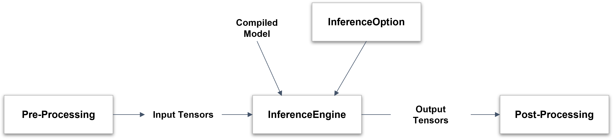
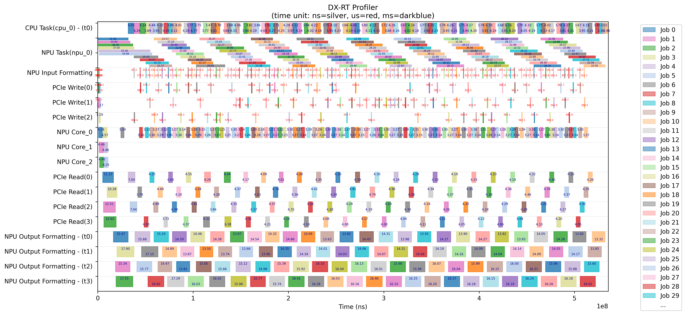

This chapter explains how to run AI model inference using the **DX-RT SDK**. It covers the model file format, step-by-step inference workflow, support for multi-device execution, tensor data handling, and profiling tools. You can also find guidance on building complete applications and optimizing CPU task throughput when using **DX-RT** in performance-critical environments.

## Model File Format

The original ONNX model is converted by **DX-COM** into the following structure.

```
Model dir.
    └── graph.dxnn
```

- `graph.dxnn`  
  : A unified DEEPX artifact that contains  NPU command data, model metadata, model parameters.  

This file is used directly for inference on DEEPX hardware.  

---

## Inference Workflow

Here the inference workflow using the DXNN Runtime as follows.  

<div class="center-text">
<p align="center">
  
<br>
Figure. Inference Workflow  
<br><br>
</p>
</div>

- Compiled Model and optional InferenceOption are provided to initialize the InferenceEngine.  
- Pre-processed Input Tensors are passed to the InferenceEngine for inference.  
- The InferenceEngine produces Output Tensors as a result of the inference.  
- These outputs are then passed to the Post-Processing stage for interpretation or further action.  

### Prepare the Model  

Choose one of the following options.  

- Use a pre-built model from **DX ModelZoo**  
- Compile an ONNX model into the **DX-RT** format using **DX-COM** (Refer to the **DEEPX DX-COM User Manual** for details.)  

---

### Configure Inference Options  

Create a `dxrt::InferenceOption` object to configure runtime settings for the inference engine.  

> **NOTE.**  
> This option is temporarily unsupported in the current version, and will be available in the next release.

---

### Load the Model into the Inference Engine  

Create a `dxrt::InferenceEngine` instance using the path to the compiled model directory. Hardware resources are automatically initialized during this step.  

If `dxrt::InferenceOption` is **not** provided, a default option is applied.  

```
auto ie = dxrt::InferenceEngine("yolov5s.dxnn");
auto ie = dxrt::InferenceEngine("yolov5s.dxnn", &option);
```

---

### Connect Input Tensors  

Prepare input buffers for inference.  

The following example shows how to initialize the buffer with the appropriate size.  

```
std::vector<uint8_t> inputBuf(ie.GetInputSize(), 0);  
```

Refer to **DX-APP User Guide** for practical examples on connecting inference engines to image sources such as cameras or video, along with the preprocessing routines. 

---

### Inference

**DX-RT** provides both synchronous and asynchronous execution modes for flexible inference handling.  

#### Run - Synchronous Execution  
Use the `dxrt::InferenceEngine::Run()` method for blocking, single-core inference.  

```
auto outputs = ie.Run(inputBuf.data());
```

- This method processes input and output on the same thread.  
- This method is suitable for simple and sequential workloads.  


#### Run - Asynchronous Execution  

**With `Wait()`** 

Use `RunAsync()` to perform the inference in non-blocking mode, and retrieve results later with `Wait()`.  

```
auto jobId = ie.RunAsync(inputBuf.data());
auto outputs = ie.Wait(jobId);
```

- This method is ideal for parallel workloads where inference can run in the background.  
- This method is continuously executed while waiting for the result.  

**With `Callback function`**  

Use a callback function to handle output as soon as inference completes. 

```
std::function<int(vector<shared_ptr<dxrt::Tensor>>, void*)> postProcCallBack = \
    [&](vector<shared_ptr<dxrt::Tensor>> outputs, void *arg)
    {
        /* Process output tensors here */
        ... ...
        return 0;
    };
ie.RegisterCallback(postProcCallBack)
```

- The callback is triggered by a background thread after inference.  
- You can pass a custom argument to track input/output pairs.

> **NOTE.**  
> Output data is **only** valid within the callback scope.  

---

### Process Output Tensors  

Once inference is complete, the output tensors are processed using Tensor APIs and custom post-processing logic. You can find the templates and example code in **DX-APP** to help you implement post-process smoothly.  
As noted earlier, using callbacks allows for more efficient and real-time post-processing.  

---

## Multiple Device Inference

This feature is **not** applicable to single-NPU devices. Basically, the inference engine schedules and manages multiple devices in real time.  
If the inference option is explicitly set, the inference engine may **only** use specific devices during real-time inference for the model.  

---

## Data Format of Device Tensor  

Compiled models use the **NHWC** format by default.  

However, the input tensor formats on the device side may vary depending on the hardware’s processing type.  

**Input Tensor Formats**  

| **Type**      | **Compiled Model Format**    | **Device Format**  | **Data Size** |
|---------------|--------------------|-----------|--------------------|
| `Formatter`   | `[N, H, W, C]`  | `[N, H, W, C]`  | 8-bit  |
| `IM2COL`      | `[N, H, W, C]`  | `[N, H, align64(W*C)]`  | 8-bit  |

- Formatter Type Example: `[1, 3, 224, 224] (NCHW) -> [1, 224, 224, 3] (NHWC)`  
- IM2COL Type Example: `[1, 3, 224, 224] (NCHW) -> [1, 224, 224*3+32] (NH, aligned width x channel)`    


**Output Tensor Formats**  

The output tensor format is also aligned with the NHWC format, but with padding applied for alignment.  

 **Type**         | **Compiled Model Format**    | **Device Format**  | 
|---------------|--------------------|----------------------|
| `Aligned NHWC`      | `[N, H, W, C]`  | `[N, H, W, align64(C)]`  |

- Output Example: `[1, 40, 52, 36] (NCHW) -> [1, 52, 36, 40+24]`
   (Channel size is aligned for optimal memory access.)  

Post-processing can be performed directly without converting formats.  
The API to convert from device format to **NCHW/NHWC** format will be supported in the next release.  

---

### Automatic Dummy Padding/Slicing (USE_ORT=OFF)

Starting with v3.0.0, when ONNX Runtime is disabled (built with `USE_ORT=OFF` or runtime option `InferenceOption.use_ort = False`), the DX-RT runtime automatically:

- Pads input tensors to the NPU-aligned format required by each task (e.g., IM2COL, align64 width/channel), and
- Slices any alignment padding from output tensors before returning them to the application.

As a result, applications no longer need to manually attach input dummy bytes or remove output dummy bytes in non-ORT inference paths. This behavior applies to both C++ and Python APIs, including PPU models. If you provide user output buffers, ensure the buffer size is at least `ie.GetOutputSize()` (C++) or `ie.get_output_size()` (Python).

> Note
> - This automatic handling is internal to the runtime’s NPU format processing and does not change model-visible tensor shapes reported by the APIs.
> - When `use_ort = True`, CPU-side execution for unsupported subgraphs is enabled via ONNX Runtime; NPU tasks still follow the same alignment policy internally.

---

## Profile Application

### Gather Timing Data per Event

You can profile events within your application using the Profiler APIs. Please refer to **Section. API reference**.  

Here is a basic usage example. 

```
// Built-in core profiling event

// Enable the profiler
dxrt::Configuration::GetInstance().SetEnable(dxrt::Configuration::ITEM::PROFILER, true);

// Set attributes to show data in console and save to a file
dxrt::Configuration::GetInstance().SetAttribute(dxrt::Configuration::ITEM::PROFILER, 
dxrt::Configuration::ATTRIBUTE::PROFILER_SHOW_DATA, "ON");

dxrt::Configuration::GetInstance().SetAttribute(dxrt::Configuration::ITEM::PROFILER, 
dxrt::Configuration::ATTRIBUTE::PROFILER_SAVE_DATA, "ON");

// User's profiling event
auto& profiler = dxrt::Profiler::GetInstance();
profiler.Start("1sec");
sleep(1);
profiler.End("1sec");
```

After the application is finished, `profiler.json` is created in the working directory.

---

### Visualize Profiler Data  

You can visualize the profiling results using the following Python script.  

```
python3 tool/profiler/plot.py --input profiler.json
```

This generates an image file named `profiler.png`, providing a detailed view of runtime event timing for performance analysis.  

<div class="center-text">
<p align="center">
  
<br>
Figure. DX-RT Profiling Report  
<br><br>
</p>
</div>


**Script Usage:** `tool/profiler/plot.py`  

Use this script to draw a timing chart from profiling data generated by **DX-RT**.

```
usage: plot.py [-h] [-i INPUT] [-o OUTPUT] [-s START] [-e END] [-g]
```

Optional Arguments  

- `-h, --help`: Show help message and exit  
- `-i INPUT, --input INPUT`: Input `.json` file to visualize (e.g., `profiler.json`)  
- `-o OUTPUT, --output OUTPUT`: Output image file name to save (e.g., profiler.png)  
- `-s START, --start START`: Starting position (normalized, > 0.0) within the time interval [0.0-1.0]  
- `-e END, --end END`: End position (normalized, < 1.0) within the time interval [0.0-1.0]  
- `-g, --show_gap`: Show time gaps between the start point of each event  

Please refer to usage of `tool/profiler/plot.py`.  

```
usage: plot.py [-h] [-i INPUT] [-o OUTPUT] [-s START] [-e END] [-g]
```

---

## How To Create an Application Using DX-RT
  
This guide provides step-by-step instructions for creating a new CMake project using the **DX-RT** library.

**Step 1.** Build the **DX-RT** Library   
Before starting, make sure the **DX-RT** library is already built.  

Refer to **Section. Installation on Linux** and **Section. Installation on Windows** for detailed build instructions. 

**Step 2.** Create a New CMake Project   
Create a project directory and an initial `CMakeLists.txt` file.  

```

mkdir MyProject
cd MyProject
touch CMakeLists.txt
```

**Step 3.** “Hello World” with DX-RT API  
Create a simple source file (`main.cpp`) that uses a **DX-RT** API.  

```
#include "dxrt/dxrt_api.h"
using namespace std;

int main(int argc, char *argv[])
{
 auto& devices = dxrt::CheckDevices();
 cout << "hello, world" << endl;
 return 0;
}
```

**Step 4.** Modify `CMakeLists.txt`  
Edit the `CMakeLists.txt` file as follows.  

```
cmake_minimum_required(VERSION 3.14)
project(app_template)

set(CMAKE_CXX_STANDARD_REQUIRED "ON")
set(CMAKE_CXX_STANDARD "14")

# Set the DX-RT library installation path (adjust as needed)
set(DXRT_LIB_PATH "/usr/local/lib") 

# Locate the DX-RT library
find_library(DXRT_LIBRARY REQUIRED NAMES dxrt_${CMAKE_SYSTEM_PROCESSOR} PATHS $
{DXRT_LIB_PATH})

# Add executable and link libraries
add_executable(HelloWorld main.cpp)
target_link_libraries(HelloWorld PRIVATE ${DXRT_LIBRARY} protobuf)
```

Replace `/usr/local/lib` with the actual path where the **DX-RT** library is installed.

**Step 5.** Build the Project  
Compile your project using the following commands.  

```
mkdir build
cd build
cmake ..
make
```

**Step 6.** Run the Executable  
After a successful build, run the generated executable.   

```
./HelloWorld
```

You now successfully create and build a CMake project using the **DX-RT** library. 

---

## (Optional) Improving CPU Task Throughput

The `USE_ORT` enables the use of ONNX Runtime to handle operations that are **not** supported by the NPU. When this option is active, CPU-based execution is applied for the unsupported subgraphs of the model via ONNX Runtime.  

### Improving CPU Capacity with Dynamic Threading 
When executing CPU task via ONNX Runtime, performance bottlenecks may arise depending on the Host CPU performance and symbol load. To address this, **DX-RT** provides an optional dynamic multi-threading feature that can improve throughput  in high-load scenarios.  

**Feature Overview**  
- Dynamically increases the number of threads allocated to ONNX Runtime tasks  
- Monitors the input queue load to determine CPU congestion  
- Designed to boost FPS when CPU-bound tasks become a bottleneck  

**Enabling Dynamic CPU Threading**  
To enable this feature, set the following environment variable:  
```bash
export DXRT_DYNAMIC_CPU_THREAD=ON
```

This activates internal logic to automatically adjust the ONNX Runtime thread pool size based on queue pressure.  

> **NOTE.**  
> When high CPU task load is detected at runtime, the system may print the following message:  
> ```bash
> To improve FPS, set: 'export DXRT_DYNAMIC_CPU_THREAD=O'
> ```
> This serves as a recommendation to enable the feature for improved inference performance.  


> **WARNING.**  
> Enabling the `DXRT_DYNAMIC_CPU_THREAD=ON` option does **not** guarantee an FPS improvement in all cases. The effectiveness of this feature depends on the specific workload, input size, and CPU capacity of the system.  
