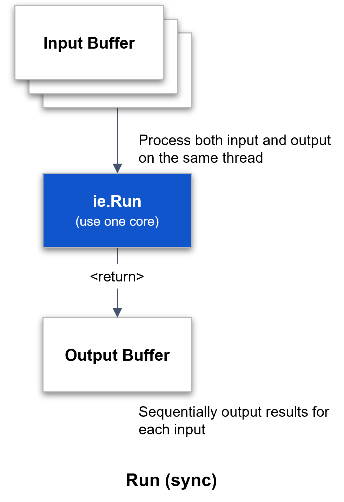
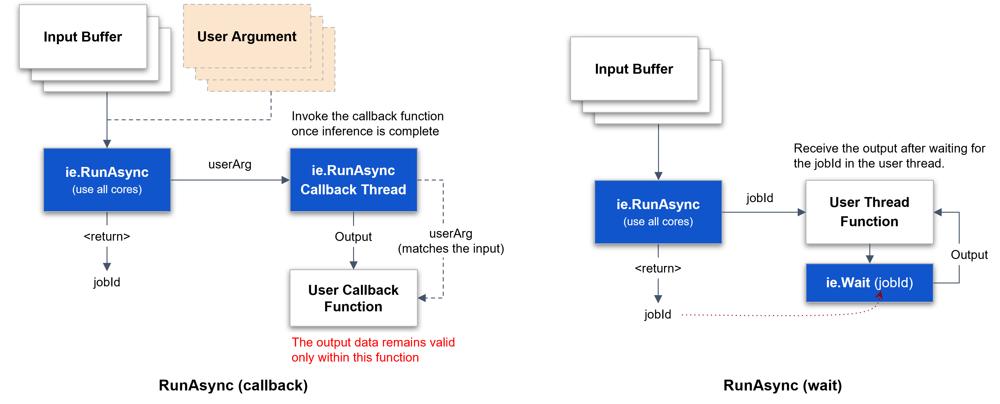
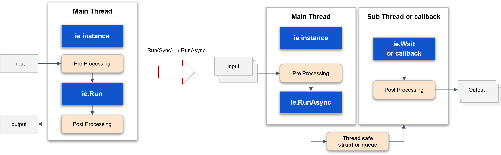
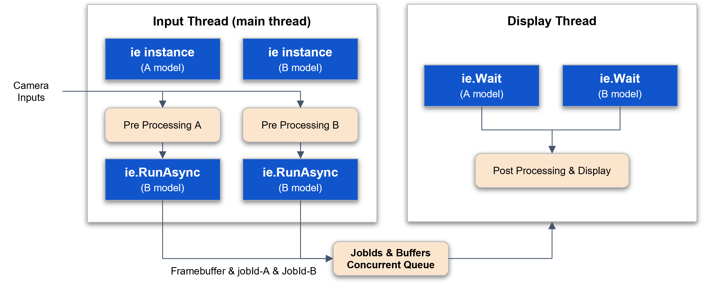
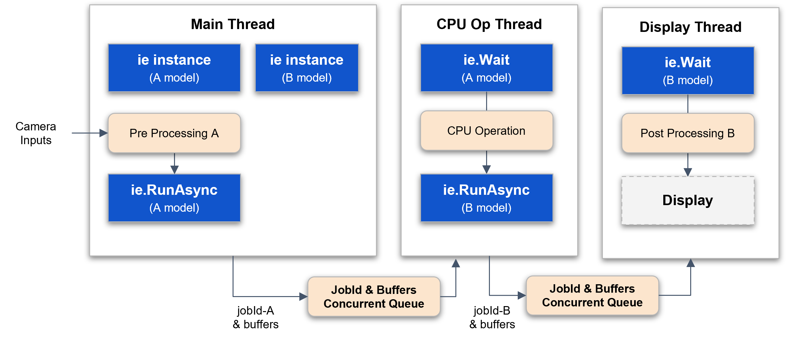

This section provides C++ tutorials covering core DXRT SDK features, including synchronous/asynchronous inference, batch processing, and runtime configuration. The examples help developers quickly integrate DXRT into real-time and embedded applications.

### Run (Synchronous)

The synchronous Run method uses a single NPU core to perform inference in a blocking manner. It can be configured to utilize multiple NPU cores simultaneously by employing threads to run each core independently.  

<div class="center-text">
<p align="center">
  
<br>
Figure. Synchronous Inference Operation  
<br><br>
</p>
</div>

Inference Engine Run synchronous  

- Inference synchronously  
- Use **only** one npu core  

The following is the simplest example of synchronous inference.  

***`run_sync_model.cpp`***
```
// DX-RT includes
#include "dxrt/dxrt_api.h"
...

int main()
{
    std::string modelPath = "model-path";

    try 
    {
        // create inference engine instance with model
        dxrt::InferenceEngine ie(modelPath);

        // create temporary input buffer for example
        std::vector<uint8_t> inputPtr(ie.GetInputSize(), 0);

        // inference loop
        for(int i = 0; i < 100; ++i)
        {
            // inference synchronously
            // use only one npu core
            auto outputs = ie.Run(inputPtr.data());

            // post processing
            postProcessing(outputs);

        } // for i
    }
    catch(const dxrt::Exception& e)  // exception for inference engine  
    {
        std::cerr << e.what() << " error-code=" << e.code() << std::endl;
        return -1;
    }
    catch(const std::exception& e)
    {
        std::cerr << e.what() << std::endl;
        return -1;
    }

    return 0;
}
```

---

### RunAsync (Asynchronous)

The asynchronous Run mode is a method that performs inference asynchronously while utilizing multiple NPU cores simultaneously. It can be implemented to maximize NPU resources through a callback function or a thread wait mechanism.  

<div class="center-text">
<p align="center">
  
<br>
Figure. Asynchronous Inference Operation  
<br><br>
</p>
</div>

Inference Engine RunAsync, Callback, User Argument  

- the outputs are guaranteed to be valid **only** within this callback function  
- processing this callback functions as quickly as possible is beneficial for improving inference performance  
- inference asynchronously, use all npu cores  
- if `device-load >= max-load-value`, this function will block  

The following is an example of asynchronous inference using a callback function. A user argument can be used to synchronize the input with the output of the callback.  

***`run_async_model.cpp`***
```
// DX-RT includes
#include "dxrt/dxrt_api.h"
...

int main(int argc, char* argv[])
{
    ...

    int callback_count = 0;

    try 
    {

        std::mutex cv_mutex;
        std::condition_variable cv;
    
        // create inference engine instance with model
        dxrt::InferenceEngine ie(model_path);

        // register call back function
        ie.RegisterCallback([&callback_count, &loop_count, &cv_mutex, &cv] 
            (dxrt::TensorPtrs &outputs, void *userArg) {

            std::ignore = outputs;
            std::ignore = userArg;

            std::unique_lock<std::mutex> lock(cv_mutex);
            callback_count++;
            if ( callback_count == loop_count ) cv.notify_one();

            return 0;
        });

        // create temporary input buffer for example
        std::vector<uint8_t> inputPtr(ie.GetInputSize(), 0);

        auto start = std::chrono::high_resolution_clock::now();

        // inference loop
        for(int i = 0; i < loop_count; ++i)
        {
            // user argument
            std::pair<int, int> *userData = new std::pair<int, int>(i, loop_count);

            // inference asynchronously, use all npu cores
            ie.RunAsync(inputPtr.data(), userData);

            log.Debug("Inference request submitted with user_arg(" + std::to_string(i) + ")");
        }

        // wait until all callbacks have been processed
        std::unique_lock<std::mutex> lock(cv_mutex);
        cv.wait(lock, [&callback_count, &loop_count] { 
            return callback_count == loop_count;
        });

        ...
  
    }
    catch (const dxrt::Exception& e)
    {
        ...
        return -1;
    }
    catch (const std::exception& e)
    {
        ...
        return -1;
    }
    catch(...)
    {
        ...
        return -1;
    }
    
    return (callback_count == loop_count ? 0 : -1);
}
```

The following is an example where multiple threads start input and inference, and a single callback processes the output.  

Inference Engine RunAsync, Callback, User Argument, Thread  

- the outputs are guaranteed to be valid **only** within this callback function  
- processing this callback functions as quickly as possible is beneficial for improving inference performance  
- inference asynchronously, use all npu cores  
- if `device-load >= max-load-value`, this function will block  

***`run_async_model_thread.cpp`***
```
// DX-RT includes
#include "dxrt/dxrt_api.h"
...

static const int THREAD_COUNT = 3;
static std::atomic<int> gResultCount = {0};
static std::atomic<int> gTotalCount = {0};
static ConcurrentQueue<int> gResultQueue(1);
static std::mutex gCBMutex;

static int inferenceThreadFunc(dxrt::InferenceEngine& ie, std::vector<uint8_t>& inputPtr, int threadIndex, int loopCount)
{

    // inference loop
    for(int i = 0; i < loopCount; ++i) 
    {
        // user argument
        UserData *userData = new UserData();

        // thread index 
        userData->setThreadIndex(threadIndex);

        // total loop count
        userData->setLoopCount(loopCount);

        // loop index
        userData->setLoopIndex(i);

        try
        {
            // inference asynchronously, use all npu cores
            // if device-load >= max-load-value, this function will block  
            ie.RunAsync(inputPtr.data(), userData);
        }
        catch(const dxrt::Exception& e)
        {
            std::cerr << e.what() << " error-code=" << e.code() << std::endl;
            std::exit(-1);
        }
        catch(const std::exception& e)
        {
            std::cerr << e.what() << std::endl;
            std::exit(-1);
        }

    } // for i

    return 0;

}

// invoke this function asynchronously after the inference is completed
static int onInferenceCallbackFunc(dxrt::TensorPtrs &outputs, void *userArg)
{

    // the outputs are guaranteed to be valid only within this callback function
    // processing this callback functions as quickly as possible is beneficial 
    // for improving inference performance

    // user data type casting
    UserData *user_data = reinterpret_cast<UserData*>(userArg);

    // thread index
    int thread_index = user_data->getThreadIndex();

    // loop index
    int loop_index = user_data->getLoopIndex();

    // post processing
    // transfer outputs to the target thread by thread_index
    // postProcessing(outputs, thread_index);
    (void)outputs;

    
    // result count 
    {
        // Mutex locks should be properly adjusted 
        // to ensure that callback functions are thread-safe.
        std::lock_guard<std::mutex> lock(gCBMutex);

        gResultCount++;
        if ( gResultCount.load() == gTotalCount.load() ) gResultQueue.push(0);
    }

    // delete argument object 
    delete user_data;

    return 0;
}


int main(int argc, char* argv[])
{
    ...

    bool result = false;

    try
    {
        // create inference engine instance with model
        dxrt::InferenceEngine ie(modelPath);

        // register call back function
        ie.RegisterCallback(onInferenceCallbackFunc);    
    
        // create temporary input buffer for example
        std::vector<uint8_t> inputPtr(ie.GetInputSize(), 0);

        gTotalCount.store(loop_count * THREAD_COUNT);

        // thread vector 
        std::vector<std::thread> thread_array;

        for(int i = 0; i < THREAD_COUNT; ++i)
        {
            // create thread
            thread_array.push_back(std::thread(inferenceThreadFunc, std::ref(ie), std::ref(inputPtr), i, loop_count));
        }

        for(auto &t : thread_array)
        {
            t.join();
        } // for t


        // wait until all callbacks have been processed
        gResultQueue.pop();

    }
    catch (const dxrt::Exception& e)
    {
        std::cerr << e.what() << " error-code=" << e.code() << std::endl;
        return -1;
    }
    catch (const std::exception& e)
    {
        std::cerr << e.what() << std::endl;
        return -1;
    }
    catch(...)
    {
        std::cerr << "Exception" << std::endl;
        return -1;
    }
    
    return result ? 0 : -1;
}

```

The following is an example of performing asynchronous inference by creating an inference wait thread. The main thread starts input and inference, and the inference wait thread retrieves the output data corresponding to the input.  

Inference Engine RunAsync, Wait  

- inference asynchronously, use all npu cores  
- if `device-load >= max-load-value`, this function will block  

***`run_async_model_wait.cpp`***
```
// DX-RT includes
#include "dxrt/dxrt_api.h"
...

// concurrent queue is a thread-safe queue data structure 
// designed to be used in a multi-threaded environment
static ConcurrentQueue<int> gJobIdQueue;

// user thread to wait for the completion of inference 
static int inferenceThreadFunc(dxrt::InferenceEngine& ie, int loopCount)
{
    int count = 0;

    while(...)
    {
        // pop item from queue 
        int jobId = gJobIdQueue.pop();

        try 
        {
            // waiting for the inference to complete by jobId 
            auto outputs = ie.Wait(jobId);

            // post processing 
            postProcessing(outputs);

        }
        catch(const dxrt::Exception& e)  // exception for inference engine 
        {
            std::cerr << e.what() << " error-code=" << e.code() << std::endl;
            std::exit(-1);
        }
        catch(const std::exception& e)
        {
            std::cerr << e.what() << std::endl;
            std::exit(-1);
        }

        // something to do

        count++;
        if ( count >= loopCount ) break;

    } // while

    return 0;
}

int main()
{
    const int LOOP_COUNT = 100;
    std::string modelPath = "model-path";

    try
    {
        // create inference engine instance with model
        dxrt::InferenceEngine ie(modelPath);

        // do not register call back function
        // inferenceEngine.RegisterCallback(onInferenceCallbackFunc);

        // create temporary input buffer for example
        std::vector<uint8_t> inputPtr(ie.GetInputSize(), 0);

        // create thread
        auto t1 = std::thread(inferenceThreadFunc, std::ref(ie), LOOP_COUNT);

        // inference loop
        for(int i = 0; i < LOOP_COUNT; ++i)
        {

            // no need user argument
            // UserData *userData = getUserDataInstanceFromDataPool();

            // inference asynchronously, use all npu cores
            // if device-load >= max-load-value, this function will block
            auto jobId = ie.RunAsync(inputPtr.data());

            // push jobId in global queue variable
            gJobIdQueue.push(jobId);

        } // for i

        t1.join();
    }
    catch(const dxrt::Exception& e)  // exception for inference engine 
    {
        std::cerr << e.what() << " error-code=" << e.code() << std::endl;
        return -1;
    }
    catch(std::exception& e)
    {
        std::cerr << e.what() << std::endl;
        return -1;
    }

    return 0;
}
```

-----

### Run (Batch)
The following is an example of batch inference with multiple inputs and multiple outputs.

***`run_batch_model.cpp`***

```
int main(int argc, char* argv[])
{
    ...
    
    try
    {

        // create inference engine instance with model
        dxrt::InferenceEngine ie(modelPath);

        // create temporary input buffer for example
        std::vector<uint8_t> inputBuffer(ie.GetInputSize(), 0);

        // input buffer vector
        std::vector<void*> inputBuffers;
        for(int i = 0; i < batch_count; ++i)
        {
            // assigns the same buffer pointer in this example
            inputBuffers.emplace_back(inputBuffer.data());
        }
        
        // output buffer vector
        std::vector<void*> output_buffers(batch_count, 0);

        // create user output buffers
        for(auto& ptr : output_buffers)
        {
            ptr = new uint8_t[ie.GetOutputSize()];
        } // for i

        // batch inference loop
        for(int i = 0; i < loop_count; ++i)
        {
            // inference asynchronously, use all npu core
            auto outputPtrs = ie.Run(inputBuffers, output_buffers);

            // postProcessing(outputs);
            (void)outputPtrs;
        }

        // Deallocated the user's output buffers
        for(auto& ptr : output_buffers)
        {
            delete[] static_cast<uint8_t*>(ptr);
        } // for i

    }
    catch (const dxrt::Exception& e)
    {
        std::cerr << e.what() << " error-code=" << e.code() << std::endl;
        return -1;
    }
    catch (const std::exception& e)
    {
        std::cerr << e.what() << std::endl;
        return -1;
    }
    catch(...)
    {
        std::cerr << "Exception" << std::endl;
        return -1;
    }
    
    return 0;
}
```

-----

### Run & RunAsync

The method for converting a synchronous inference approach using one NPU core into an asynchronous inference approach using multiple NPU cores is as follows. It requires the use of callbacks or threads, as well as the implementation of multiple input buffers to support concurrent operations effectively.

**Converting Run(Sync) to RunAsync**  

- Shift from Single NPU Core to Multiple Cores  
    : Modify the existing Run(Sync) structure, which utilizes a single NPU core, to RunAsync structure capable of leveraging multiple NPU cores simultaneously.  
- Create Multiple Input/Output Buffers  
    : Implement multiple input/output buffers to prevent overwriting. Ensure an appropriate number of buffers are created to support concurrent operations effectively.  
- Introduce Multi-Buffer Concept  
    : To handle simultaneous inference processes, integrate a multi-buffer mechanism. This is essential for managing concurrent inputs and outputs without data conflicts.  
- Asynchronous Inference with Threads or Callbacks  
    : Adjust the code to ensure that inference inputs and outputs operate asynchronously using threads or callbacks for efficient processing.  
- Thread-Safe Data Exchange  
    : For data exchange between threads or callbacks, use a thread-safe queue or structured data mechanisms to avoid race conditions and ensure integrity.  

<div class="center-text">
<p align="center">
  
<br>
Figure. Converting Run(Sync) to RunAsync  
<br><br>
</p>
</div>

-----

### Inference Option

The following inference options allow you to specify an NPU core for performing inference.

Inference Engine Run, Inference Option  

- Select devices  
    : default devices is `{}`  
    : Choose devices to utilize  
- Select bound option per device  
    : `dxrt::InferenceOption::BOUND_OPTION::NPU_ALL`  
    : `dxrt::InferenceOption::BOUND_OPTION::NPU_0`  
    : `dxrt::InferenceOption::BOUND_OPTION::NPU_1`  
    : `dxrt::InferenceOption::BOUND_OPTION::NPU_2`  
    : `dxrt::InferenceOption::BOUND_OPTION::NPU_01`  
    : `dxrt::InferenceOption::BOUND_OPTION::NPU_12`  
    : `dxrt::InferenceOption::BOUND_OPTION::NPU_02`  
- Use onnx runtime library (`ORT`)  
    : `useORT` on or off  

***`run_sync_model_bound.cpp`***
```
// DX-RT includes
#include "dxrt/dxrt_api.h"
...

int main()
{
    std::string modelPath = "model-path";

    try
    {

        // select bound option NPU_0 to NPU_2 per device  
        dxrt::InferenceOption op;

        // first device only, default null
        op.devices.push_back(0); // use device 0 
        op.devices.push_back(3); // use device 3 

        // use BOUND_OPTION::NPU_0 only
        op.boundOption = dxrt::InferenceOption::BOUND_OPTION::NPU_0; 

        // use ORT
        op.useORT = false;

        // create inference engine instance with model
        dxrt::InferenceEngine ie(modelPath, op);

        // create temporary input buffer for example 
        std::vector<uint8_t> inputPtr(ie.GetInputSize(), 0);

        // inference loop
        for(int i = 0; i < 100; ++i)
        {
            // input
            uint8_t* inputPtr = readInputData();

            // inference synchronously with boundOption
            // use only one npu core
            // ownership of the outputs is transferred to the user 
            auto outputs = ie.Run(inputPtr.data());

            // post processing
            postProcessing(outputs);

        } // for i
    }
    catch(const dxrt::Exception& e)  // exception for inference engine 
    {
        std::cerr << e.what() << " error-code=" << e.code() << std::endl;
        return -1;
    }
    catch(const std::exception& e)
    {
        std::cerr << e.what() << std::endl;
        return -1;
    }

    return 0;
}
```

-----

### Configuration and Device Status

This guide explains how to use the `Configuration` class to set up the inference engine and the `DeviceStatus` class to monitor hardware status in C++.

#### Engine Configuration

The `Configuration` class, implemented as a Singleton, allows you to set global parameters for the inference engine before it runs.

```cpp
// Get the singleton instance and set engine parameters
dxrt::Configuration::GetInstance().SetEnable(dxrt::Configuration::ITEM::SHOW_MODEL_INFO, true);
dxrt::Configuration::GetInstance().SetEnable(dxrt::Configuration::ITEM::SHOW_PROFILE, true);
```

  - **`Configuration::GetInstance()`**: Accesses the single, global instance of the configuration manager.
  - **`.SetEnable(...)`**: Enables engine features. Here, it's configured to print detailed model information and performance profiling data when the `InferenceEngine` is initialized.

#### Querying Device Status

The `DeviceStatus` class is used to get real-time operational information from the NPU hardware. This is often done after a workload to check the device's state.

```cpp
// Get the number of available devices
auto device_count = dxrt::DeviceStatus::GetDeviceCount();

// Loop through each device
for(int i = 0; i < device_count; ++i)
{
    // Get a status snapshot for the current device
    auto device_status = dxrt::DeviceStatus::GetCurrentStatus(i);
    
    // Query and print specific metrics like temperature, voltage, and clock speed
    log.Info("Device: " + std::to_string(device_status.GetId()));
    log.Info("   Temperature: " + std::to_string(device_status.GetTemperature(0)));
    log.Info("   Voltage: " + std::to_string(device_status.GetNpuVoltage(0)));
    log.Info("   Clock: " + std::to_string(device_status.GetNpuClock(0)));
}
```

  - **`DeviceStatus::GetDeviceCount()`**: A static method that returns the number of connected DEEPX devices.
  - **`DeviceStatus::GetCurrentStatus(i)`**: Returns a status object containing a **snapshot** of the hardware metrics for device `i` at that specific moment.
  - **`device_status.Get...()`**: Instance methods used to retrieve individual metrics from the status object, such as `GetTemperature()`, `GetNpuVoltage()`, and `GetNpuClock()` for a specific NPU core (e.g., core 0).

-----

### Profiler Configuration

This guide provides a simple, code-focused manual on how to configure the profiler using the DXRT SDK. The profiler is a powerful tool for analyzing the performance of each layer within your model.

Configuration is managed through the `dxrt::Configuration` singleton instance.

#### Enabling the Profiler

Before you can use any profiler features, you **must** first enable it. This is the essential first step for any profiling activity.

```cpp
// Enable the profiler feature
dxrt::Configuration::GetInstance().SetEnable(dxrt::Configuration::ITEM::PROFILER, true);
```

  - **`SetEnable`**: This function activates or deactivates a specific DXRT feature.
  - **`dxrt::Configuration::ITEM::PROFILER`**: Specifies that the target feature is the profiler.
  - **`true`**: Enables the profiler. Set to `false` to disable it.

#### Configuration Options

Once enabled, you can set specific attributes for the profiler's behavior.

***Displaying Profiler Data in the Console***

To see the profiling results printed directly to your console after the inference runs, use the `PROFILER_SHOW_DATA` attribute.

```cpp
// Configure the profiler to print its report to the console
dxrt::Configuration::GetInstance().SetAttribute(dxrt::Configuration::ITEM::PROFILER,
                                                 dxrt::Configuration::ATTRIBUTE::PROFILER_SHOW_DATA, "ON");
```

  - **`SetAttribute`**: Sets a specific property for a DXRT feature.
  - **`PROFILER_SHOW_DATA`**: The attribute to control console output.
  - **`"ON"`**: A string value to enable this attribute. Use `"OFF"` to disable it.

***Saving Profiler Data to a File***

To save the profiling report to a file for later analysis, use the `PROFILER_SAVE_DATA` attribute. The resulting report is generated in the same folder with the name **`profiler.json`**. 📄

```cpp
// Configure the profiler to save its report to a file
dxrt::Configuration::GetInstance().SetAttribute(dxrt::Configuration::ITEM::PROFILER,
                                                 dxrt::Configuration::ATTRIBUTE::PROFILER_SAVE_DATA, "ON");
```

  - **`PROFILER_SAVE_DATA`**: The attribute to control file output.
  - **`"ON"`**: A string value to enable file saving. Use `"OFF"` to disable it.

#### Complete Code Example

Here is a complete example showing how to apply all the configurations within a `try-catch` block before creating the `InferenceEngine`.

```cpp
try 
{
    // Step 1: Enable the profiler
    dxrt::Configuration::GetInstance().SetEnable(dxrt::Configuration::ITEM::PROFILER, true);

    // Step 2: Set attributes to show data in console and save to a file
    dxrt::Configuration::GetInstance().SetAttribute(dxrt::Configuration::ITEM::PROFILER, 
    dxrt::Configuration::ATTRIBUTE::PROFILER_SHOW_DATA, "ON");
    
    dxrt::Configuration::GetInstance().SetAttribute(dxrt::Configuration::ITEM::PROFILER,     
    dxrt::Configuration::ATTRIBUTE::PROFILER_SAVE_DATA, "ON");
    
    // Step 3: Create the InferenceEngine instance and run inference
    // The profiler will automatically work on the models run by this engine.
    dxrt::InferenceEngine ie(model_path);

    // ... run inference loop ...
}
catch (const dxrt::Exception& e)
{
    // ... handle exceptions ...
}
```

-----

### Camera / Inference / Display

The following is an example of a pattern that performs inference using two models on a single camera input and combines the results from both models for display.

<div class="center-text">
<p align="center">
  
<br>
Figure. Multi-model and Multi-output  
<br><br>
</p>
</div>
  
Multi-model, Async, Wait Thread `(CPU_1 → {NPU_1 + NPU_2} → CPU_2`  

***`display_async_wait.cpp`***
```
// DX-RT includes
#include "dxrt/dxrt_api.h"
...

// input processing main thread with 2 InferenceEngine (asynchronous) 
// display thread 

struct FrameJobId {
    int jobId_A = -1;
    int jobId_B = -1;
    void* frameBuffer = nullptr;
    int loopIndex = -1;
};

static const int BUFFER_POOL_SIZE = 10;
static const int QUEUE_SIZE = 10;

static ConcurrentQueue<FrameJobId> gFrameJobIdQueue(QUEUE_SIZE);
static std::shared_ptr<SimpleCircularBufferPool<uint8_t>> gInputBufferPool_A;
static std::shared_ptr<SimpleCircularBufferPool<uint8_t>> gInputBufferPool_B;
static std::shared_ptr<SimpleCircularBufferPool<uint8_t>> gFrameBufferPool;

// total display count
static std::atomic<int> gTotalDisplayCount = {0};

static int displayThreadFunc(int loopCount, dxrt::InferenceEngine& ieA, dxrt::InferenceEngine& ieB)
{

    while(gTotalDisplayCount.load() < loopCount)
    {
        // consumer framebuffer & jobIds
        auto frameJobId = gFrameJobIdQueue.pop();

        // output data of ieA
        auto outputA = ieA.Wait(frameJobId.jobId_A);

        // output data of ieB
        auto outputB = ieB.Wait(frameJobId.jobId_B);

        // post-processing w/ outputA & outputB
        postProcessing(outputA, outputB);

        gTotalDisplayCount++;

        // display (update framebuffer)
    }

    return 0;
}


int main(int argc, char* argv[])
{
    ...

    try
    {

        // create inference engine instance with model
        dxrt::InferenceEngine ieA(modelPath_A);

        gInputBufferPool_A = std::make_shared<SimpleCircularBufferPool<uint8_t>>(BUFFER_POOL_SIZE, ieA.GetInputSize());
      
        // create inference engine instance with model
        dxrt::InferenceEngine ieB(modelPath_B);

        gInputBufferPool_B = std::make_shared<SimpleCircularBufferPool<uint8_t>>(BUFFER_POOL_SIZE, ieB.GetInputSize());

        const int W = 512, H = 512, CH = 3;
        gFrameBufferPool = std::make_shared<SimpleCircularBufferPool<uint8_t>>(BUFFER_POOL_SIZE, W*H*CH);
    
        // create thread
        std::thread displayThread(displayThreadFunc, loop_count, std::ref(ieA), std::ref(ieB));
        
        // input processing
        for(int i = 0; i < loop_count; ++i)
        {
            uint8_t* frameBuffer = gFrameBufferPool->pointer(); 
            readFrameBuffer(frameBuffer, W, H, CH);

            uint8_t* inputA = gInputBufferPool_A->pointer();
            preProcessing(inputA, frameBuffer);

            uint8_t* inputB = gInputBufferPool_B->pointer();
            preProcessing(inputB, frameBuffer);

            // struct to pass to cpu operation thread 
            FrameJobId frameJobId;

            // start inference of A model
            frameJobId.jobId_A = ieA.RunAsync(inputA);

            // start inference of B model
            frameJobId.jobId_B = ieB.RunAsync(inputB);

            // framebuffer used for input data
            frameJobId.frameBuffer = frameBuffer;
            frameJobId.loopIndex = i;

            // producer frame & jobId
            gFrameJobIdQueue.push(frameJobId);

        }

        displayThread.join();
  
        
    }
    catch (const dxrt::Exception& e)
    {
        std::cerr << e.what() << " error-code=" << e.code() << std::endl;
        return -1;
    }
    catch (const std::exception& e)
    {
        std::cerr << e.what() << std::endl;
        return -1;
    }
    catch(...)
    {
        std::cerr << "Exception" << std::endl;
        return -1;
    }
    
    return 0;
}
```

The following is an example of a pattern that sequentially performs operations using two models and CPU processing. The inference result from Model A is processed through CPU computation and then used as input data for Model B. Finally, the result from Model B is handled for display.

<div class="center-text">
<p align="center">
  
<br>
Figure. CPU and NPU Pipeline Operation  
<br><br>
</p>
</div>

Multi-model, Async, Wait Thread `(CPU_1 → NPU_1 → CPU_2 → NPU_2 → CPU_3)`  

***`display_async_pipe.cpp`***
```
// DX-RT includes
#include "dxrt/dxrt_api.h"
...

// input main thread 
// 1 cpu processing thread  
// 1 display thread 

struct FrameJobId {
    int jobId_A = -1;
    int jobId_B = -1;
    uint8_t* inputBufferA;
    uint8_t* inputBufferB;
    void* frameBuffer = nullptr;

    int loopIndex;
};

static const int BUFFER_POOL_SIZE = 10;
static const int QUEUE_SIZE = 10;

static ConcurrentQueue<FrameJobId> gCPUOPQueue(QUEUE_SIZE);
static ConcurrentQueue<FrameJobId> gDisplayQueue(QUEUE_SIZE);
static std::shared_ptr<SimpleCircularBufferPool<uint8_t>> gInputBufferPool_A;
static std::shared_ptr<SimpleCircularBufferPool<uint8_t>> gInputBufferPool_B;
static std::shared_ptr<SimpleCircularBufferPool<uint8_t>> gFrameBufferPool;

// total display count
static std::atomic<int> gTotalDisplayCount = {0};


static int displayThreadFunc(int loopCount, dxrt::InferenceEngine& ieB)
{

    while(gTotalDisplayCount.load() < loopCount)
    {
        // consumer framebuffer & jobIds
        auto frameJobId = gDisplayQueue.pop();

        // output data of ieB
        auto outputB = ieB.Wait(frameJobId.jobId_B);

        // post-processing w/ outputA & outputB
        postProcessingB(outputB);
        
        gTotalDisplayCount++;

        // display (update framebuffer)
        if ( frameJobId.loopIndex == (loopCount - 1)) break;
    }

    return 0;
}

static int cpuOperationThreadFunc(int loopCount, dxrt::InferenceEngine& ieA, dxrt::InferenceEngine& ieB)
{

    while(gTotalDisplayCount.load() < loopCount)
    {
        // consumer framebuffer & jobIds
        auto frameJobIdA = gCPUOPQueue.pop();

        // output data of ieA
        auto outputA = ieA.Wait(frameJobIdA.jobId_A);

        // post-processing w/ outputA
        postProcessingA(frameJobIdA.inputBufferB, outputA);

        FrameJobId frameJobIdB;
        frameJobIdB.loopIndex = frameJobIdA.loopIndex;
        frameJobIdB.jobId_B = ieB.RunAsync(frameJobIdA.inputBufferB);

        gDisplayQueue.push(frameJobIdB);

        // display (update framebuffer)
        if ( frameJobIdA.loopIndex == (loopCount - 1)) break;
    }

    return 0;
}


int main(int argc, char* argv[])
{

    ...

    try
    {

        // create inference engine instance with model
        dxrt::InferenceEngine ieA(modelPath);

        gInputBufferPool_A = std::make_shared<SimpleCircularBufferPool<uint8_t>>(BUFFER_POOL_SIZE, ieA.GetInputSize());
      
        // create inference engine instance with model
        dxrt::InferenceEngine ieB(modelPath);

        gInputBufferPool_B = std::make_shared<SimpleCircularBufferPool<uint8_t>>(BUFFER_POOL_SIZE, ieB.GetInputSize());

        const int W = 512, H = 512, CH = 3;
        gFrameBufferPool = std::make_shared<SimpleCircularBufferPool<uint8_t>>(BUFFER_POOL_SIZE, W*H*CH);
    
        // create thread
        std::thread cpuOperationThread(cpuOperationThreadFunc, loop_count, std::ref(ieA), std::ref(ieB));
        std::thread displayThread(displayThreadFunc, loop_count, std::ref(ieB));
        
        
        // input processing
        for(int i = 0; i < loop_count; ++i)
        {
            uint8_t* frameBuffer = gFrameBufferPool->pointer(); 
            readFrameBuffer(frameBuffer, W, H, CH);

            uint8_t* inputA = gInputBufferPool_A->pointer();
            preProcessing(inputA, frameBuffer);

            // struct to pass to a thread 
            FrameJobId frameJobId;

            frameJobId.inputBufferA = inputA;
            frameJobId.inputBufferB = gInputBufferPool_B->pointer();

            // start inference of A model
            frameJobId.jobId_A = ieA.RunAsync(inputA);

            // framebuffer used for input data
            frameJobId.frameBuffer = frameBuffer;
            frameJobId.loopIndex = i;

            // producer frame & jobId
            gCPUOPQueue.push(frameJobId);

        }

        cpuOperationThread.join();
        displayThread.join();

    }
    catch (const dxrt::Exception& e)
    {
        std::cerr << e.what() << " error-code=" << e.code() << std::endl;
        return -1;
    }
    catch (const std::exception& e)
    {
        std::cerr << e.what() << std::endl;
        return -1;
    }
    catch(...)
    {
        std::cerr << "Exception" << std::endl;
        return -1;
    }
    
    return 0;
}
```

-----

### Exception

The error codes and types of exceptions for error handling are as follows.

```
enum ERROR_CODE {
        DEFAULT = 0x0100,
        FILE_NOT_FOUND,
        NULL_POINTER,
        FILE_IO,
        INVALID_ARGUMENT,
        INVALID_OPERATION,
        INVALID_MODEL,
        MODEL_PARSING,
        SERVICE_IO,
        DEVICE_IO
    };
```

- FileNotFoundException  
- NullPointerException  
- FileIOException  
- InvalidArgumentException  
- InvalidOperationException  
- InvalidModelException  
- ModelParsingException  
- ServiceIOException  
- DeviceIOException  

```
    // try/catch prototype

    try
    {
        // DX-RT APIs ...
    }
    catch(const dxrt::Exception& e)  // exception for inference engine 
    {
        std::cerr << e.what() << " error-code=" << e.code() << std::endl;
        return -1; // or std::exit(-1);
    }
    catch(std::exception& e)
    {
        std::cerr << e.what() << std::endl;
        return -1;  // or std::exit(-1);
    }
```

-----

### Multi-Input Inference

This guide explains various methods for performing inference on multi-input models using the `dxrt::InferenceEngine`. The examples cover different input formats, synchronous and asynchronous execution, and batch processing.  

#### Model Information

Before running inference, it's useful to inspect the model's properties. The `printModelInfo` function shows how to query the inference engine for details about the model's input and output tensors.

  - **`ie.IsMultiInputModel()`**: Checks if the loaded model has multiple inputs.
  - **`ie.GetInputTensorCount()`**: Gets the number of input tensors.
  - **`ie.GetInputTensorNames()`**: Retrieves the names of all input tensors.
  - **`ie.GetInputTensorSizes()`**: Gets the size (in bytes) of each input tensor.
  - **`ie.GetOutputTensorNames()` / `ie.GetOutputTensorSizes()`**: Provide similar information for output tensors.

<!-- end list -->

```cpp
void printModelInfo(dxrt::InferenceEngine& ie) {
    if (ie.IsMultiInputModel()) {
        std::cout << "Input tensor count: " << ie.GetInputTensorCount() << std::endl;
        auto inputNames = ie.GetInputTensorNames();
        auto inputSizes = ie.GetInputTensorSizes();
        for (size_t i = 0; i < inputNames.size(); ++i) {
            std::cout << "  " << inputNames[i] << ": " << inputSizes[i] << " bytes" << std::endl;
        }
    }
}
```

#### Synchronous Single Inference

These examples demonstrate different ways to run a single inference request synchronously.  

***Input Formats***

**A.** Dictionary Format (`std::map<std::string, void*>`)

This is the most robust method. You provide a map where keys are the tensor names and values are pointers to the input data. This format is **not** sensitive to the order of tensors.

  - **API**: `ie.RunMultiInput(inputTensors)`
  - **Use Case**: Recommended for clarity and to avoid errors from tensor reordering.

<!-- end list -->

```cpp
// Create input data
std::map<std::string, void*> inputTensors;
inputTensors["input_1"] = inputData1.data();
inputTensors["input_2"] = inputData2.data();

// Run inference
auto outputs = ie.RunMultiInput(inputTensors);
```

**B.** Vector Format (`std::vector<void*>`)

You provide a vector of pointers to the input data. The order of pointers in the vector **must** match the order returned by `ie.GetInputTensorNames()`.

  - **API**: `ie.RunMultiInput(inputPtrs)`
  - **Use Case**: When tensor order is known and fixed. Can be slightly more performant than the map-based approach due to less overhead.

<!-- end list -->

```cpp
// Create input data in the correct order
std::vector<void*> inputPtrs;
inputPtrs.push_back(inputData1.data()); // Corresponds to first name in GetInputTensorNames()
inputPtrs.push_back(inputData2.data()); // Corresponds to second name

// Run inference
auto outputs = ie.RunMultiInput(inputPtrs);
```

**C.** Auto-Split Concatenated Buffer

You provide a single, contiguous buffer containing all input data concatenated together. The engine automatically splits this buffer into the correct tensor inputs based on their sizes. The concatenation order **must** match the order from `ie.GetInputTensorNames()`.

  - **API**: `ie.Run(concatenatedInput.data())`
  - **Use Case**: Efficient when input data is already in a single block or when interfacing with systems that provide data this way.

<!-- end list -->

```cpp
// Create a single buffer with all input data concatenated
auto concatenatedInput = createDummyInput(ie.GetInputSize());

// Run inference
auto outputs = ie.Run(concatenatedInput.data());
```

***Output Buffer Management***

For each synchronous method, you can either let the engine allocate output memory automatically or provide a pre-allocated buffer for performance gains.

  - **Auto-Allocated Output (No Buffer Provided)**: Simpler to use. The engine returns smart pointers to newly allocated memory.

    ```cpp
    // Engine allocates and manages output memory
    auto outputs = ie.RunMultiInput(inputTensors);
    ```

  - **User-Provided Output Buffer**: More performant as it avoids repeated memory allocations. The user is responsible for allocating a buffer of size `ie.GetOutputSize()`.

    ```cpp
    // User allocates the output buffer
    std::vector<uint8_t> outputBuffer(ie.GetOutputSize());

    // Run inference, placing results in the provided buffer
    auto outputs = ie.RunMultiInput(inputTensors, nullptr, outputBuffer.data());
    ```

****Synchronous Batch Inference****

For processing multiple inputs at once to maximize throughput, you can use the batch inference API. This is more efficient than running single inferences in a loop.  

  - **API**: `ie.Run(batchInputPtrs, batchOutputPtrs, userArgs)`
  - **Input**: A vector of pointers, where each pointer is a concatenated buffer for one sample in the batch.
  - **Output**: A vector of pointers, where each pointer is a pre-allocated buffer for the corresponding sample's output.

<!-- end list -->

```cpp
int batchSize = 3;
std::vector<void*> batchInputPtrs;
std::vector<void*> batchOutputPtrs;

// Prepare input and output buffers for each sample in the batch
for (int i = 0; i < batchSize; ++i) {
    // Each input is a full concatenated buffer
    batchInputData[i] = createDummyInput(ie.GetInputSize());
    batchInputPtrs.push_back(batchInputData[i].data());

    // Pre-allocate output buffer for each sample
    batchOutputData[i].resize(ie.GetOutputSize());
    batchOutputPtrs.push_back(batchOutputData[i].data());
}

// Run batch inference
auto batchOutputs = ie.Run(batchInputPtrs, batchOutputPtrs);
```

***Asynchronous Inference***

Asynchronous APIs allow you to submit inference requests without blocking the calling thread. The results are returned later via a callback function. This is ideal for applications that need to remain responsive, such as those with a user interface.

  - **APIs**:
      - `ie.RunAsyncMultiInput(inputTensors, userArg)`
      - `ie.RunAsync(concatenatedInput.data(), userArg)`
  - **Callback Registration**: `ie.RegisterCallback(callback_function)`

The `AsyncInferenceHandler` class demonstrates how to manage state across multiple asynchronous calls.

  - **Register a Callback**: Provide a function that the engine will call upon completion of each async request. The callback receives the output tensors and a `userArg` pointer for context.
  - **Submit Requests**: Call an `RunAsync` variant. This call returns immediately with a job ID.
  - **Process in Callback**: The callback function is executed in a separate worker thread. Here, you can process the results. It's crucial to ensure thread safety if you modify shared data.

<!-- end list -->

```cpp
// 1. Create a handler and register its callback method
AsyncInferenceHandler handler(asyncCount);
ie.RegisterCallback([&handler](dxrt::TensorPtrs& outputs, void* userArg) -> int {
    return handler.callback(outputs, userArg);
});

// 2. Submit multiple async requests in a loop
for (int i = 0; i < asyncCount; ++i) {
    void* userArg = reinterpret_cast<void*>(static_cast<uintptr_t>(i));
    // Each call is non-blocking
    ie.RunAsyncMultiInput(asyncInputTensors[i], userArg);
}

// 3. Wait for all callbacks to complete
handler.waitForCompletion();

// 4. Clear the callback when done
ie.RegisterCallback(nullptr);
```

---

### Examples

The examples provided earlier are actual code samples that can be executed. Please refer to them for practical use.  

- `display_async_pipe`  
    : An example using `[CPU_1 → {NPU_1 + NPU_2} → CPU_2]` pattern  
- `display_async_wait`  
    : An example using `[CPU_1 → NPU_1 → CPU_2 → NPU_2 → CPU_3]` pattern  
- `display_async_thread`  
    : An example using single model and multi threads  
- `display_async_models_1`  
    : An example using multi models and multi threads (Inference Engine is created within each thread)  
- `display_async_models_2`  
    : An example using multi models and multi threads (Inference Engine is created in the main thread)  
- `run_async_model`  
    : A performance-optimized example using a callback function  
- `run_async_model_thread`  
    : An example using a single inference engine, callback function, and thread  
    : Usage method when there is a single AI model and multiple inputs  
- `run_async_model_wait`  
    : An example using threads and waits  
- `run_async_model_conf`  
    : An example of using configuration  
- `run_async_model_profiler`  
    : An example of using profiler  
- `run_async_model_conf`  
    : An example of using configuration and device status  
- `run_async_model_profiler`  
    : An example of using profiler configuration 
- `run_sync_model`  
    : An example using a single thread  
- `run_sync_model_thread`  
    : An example running an inference engine on multiple threads  
- `run_sync_model_bound`  
    : An example of specifying an NPU using the bound option  
- `run_batch_model`  
    : An example of using batch inference  
- `multi_input_model_inference`  
    : An example of using multi-input model inference  

---
