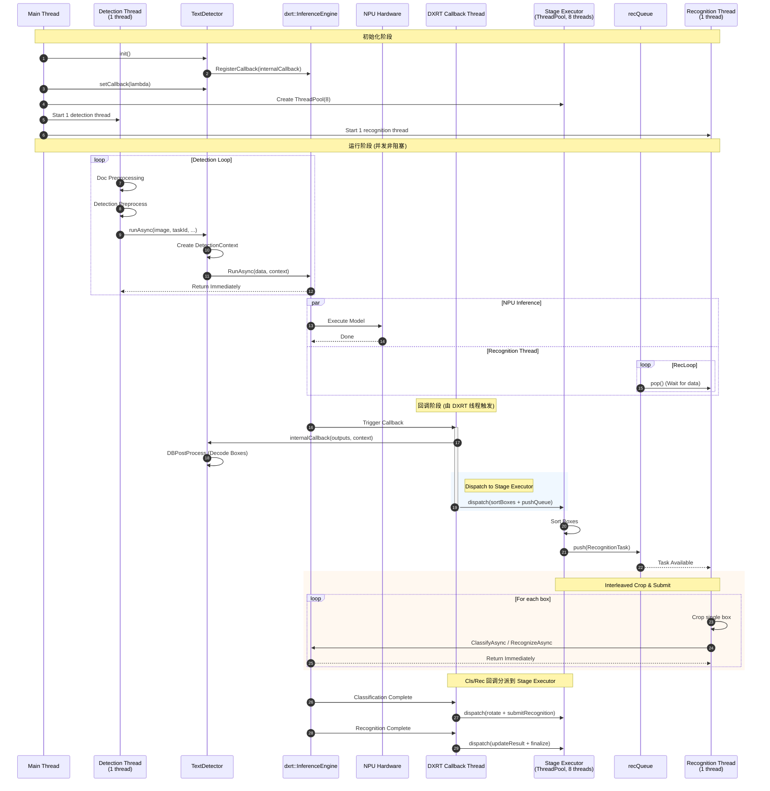
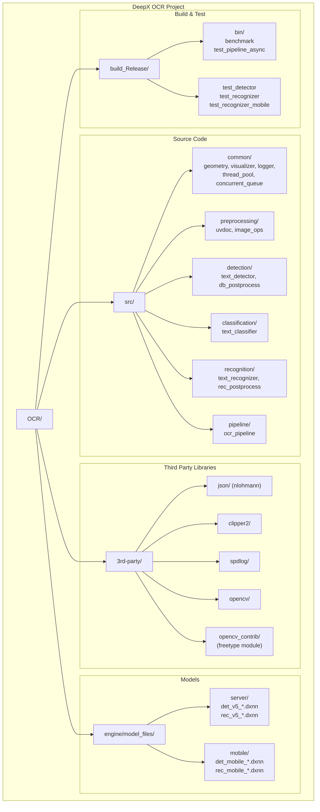
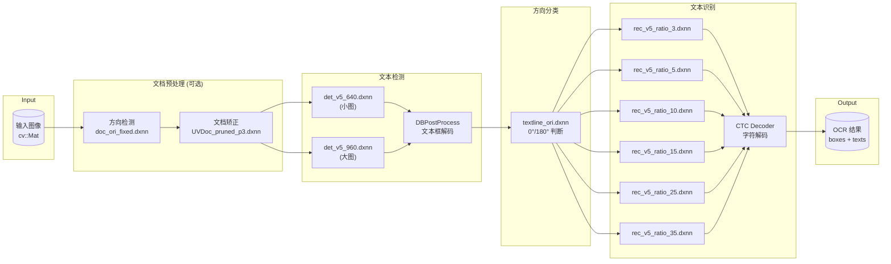

# DeepX OCR - 系统架构文档

## 1. 多线程异步非阻塞调用流程

## 2. 项目目录结构

## 3. OCR Pipeline 数据流

## 4. 模型配置

### Server 模型 (高精度)

| 模型文件 | 用途 | 输入尺寸 |
|---------|------|---------|
| `det_v5_640.dxnn` | 文本检测 (小图) | 640×640 |
| `det_v5_960.dxnn` | 文本检测 (大图) | 960×960 |
| `rec_v5_ratio_3.dxnn` | 文本识别 | 48×144 (ratio=3) |
| `rec_v5_ratio_5.dxnn` | 文本识别 | 48×240 (ratio=5) |
| `rec_v5_ratio_10.dxnn` | 文本识别 | 48×480 (ratio=10) |
| `rec_v5_ratio_15.dxnn` | 文本识别 | 48×720 (ratio=15) |
| `rec_v5_ratio_25.dxnn` | 文本识别 | 48×1200 (ratio=25) |
| `rec_v5_ratio_35.dxnn` | 文本识别 | 48×1680 (ratio=35) |
| `textline_ori.dxnn` | 文本方向分类 | 80×160 |
| `doc_ori_fixed.dxnn` | 文档方向检测 | - |
| `UVDoc_pruned_p3.dxnn` | 文档矫正 | 488×712 |

### Mobile 模型 (轻量级)

| 模型文件 | 用途 | 说明 |
|---------|------|------|
| `det_mobile_640.dxnn` | 文本检测 | 轻量版 |
| `det_mobile_960.dxnn` | 文本检测 | 轻量版 |
| `rec_mobile_ratio_*.dxnn` | 文本识别 | 6个不同宽高比 |
