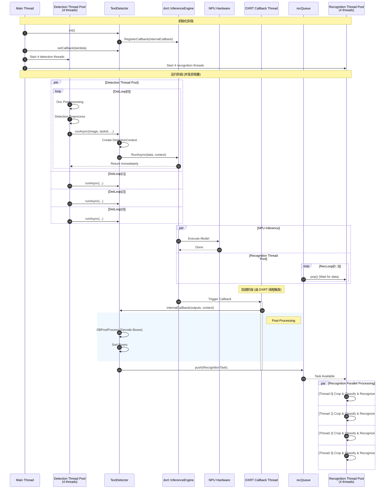

# OCR Demo - Multi-threaded Async Pipeline Architecture

## 时序图：多线程异步非阻塞调用流程

```mermaid
sequenceDiagram
    autonumber
    participant Main as Main Thread
    participant DetPool as Detection Thread Pool<br/>(4 threads)
    participant Detector as TextDetector
    participant DXRT as dxrt::InferenceEngine
    participant NPU as NPU Hardware
    participant CBThread as DXRT Callback Thread
    participant RecQueue as recQueue
    participant RecPool as Recognition Thread Pool<br/>(4 threads)

    Note over Main, RecPool: 初始化阶段
    Main->>Detector: init()
    Detector->>DXRT: RegisterCallback(internalCallback)
    Main->>Detector: setCallback(lambda)
    Main->>DetPool: Start 4 detection threads
    Main->>RecPool: Start 4 recognition threads

    Note over Main, RecPool: 运行阶段 (并发非阻塞)
    
    par Detection Thread Pool
        loop DetLoop[0]
            DetPool->>DetPool: Doc Preprocessing
            DetPool->>DetPool: Detection Preprocess
            DetPool->>Detector: runAsync(image, taskId, ...)
            Detector->>Detector: Create DetectionContext
            Detector->>DXRT: RunAsync(data, context)
            DXRT-->>DetPool: Return Immediately
        end
    and DetLoop[1]
        DetPool->>Detector: runAsync(...)
    and DetLoop[2]
        DetPool->>Detector: runAsync(...)
    and DetLoop[3]
        DetPool->>Detector: runAsync(...)
    end

    par NPU Inference
        DXRT->>NPU: Execute Model
        NPU-->>DXRT: Done
    and Recognition Thread Pool
        loop RecLoop[0..3]
            RecQueue->>RecPool: pop() (Wait for data)
        end
    end

    Note over CBThread: 回调阶段 (由 DXRT 线程触发)
    DXRT->>CBThread: Trigger Callback
    activate CBThread
    CBThread->>Detector: internalCallback(outputs, context)
    
    rect rgb(240, 248, 255)
        Note right of CBThread: Post-Processing
        Detector->>Detector: DBPostProcess (Decode Boxes)
        Detector->>Detector: Sort Boxes
    end

    Detector->>RecQueue: push(RecognitionTask)
    deactivate CBThread

    RecQueue-->>RecPool: Task Available
    
    par Recognition Parallel Processing
        RecPool->>RecPool: [Thread 0] Crop & Classify & Recognize
    and 
        RecPool->>RecPool: [Thread 1] Crop & Classify & Recognize
    and
        RecPool->>RecPool: [Thread 2] Crop & Classify & Recognize
    and
        RecPool->>RecPool: [Thread 3] Crop & Classify & Recognize
    end
```